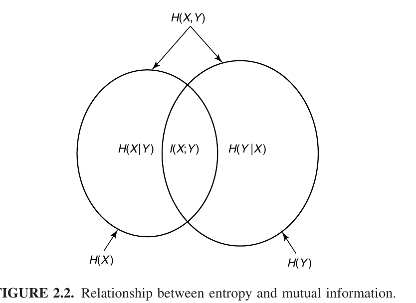

# EE142 Information Theory Course Note part 1: basic concepts

> - textbook: Elements of Information Theory.
> - author: Thomas M. Cover
> - course: ShanghaiTech EE142 Information Theory

[TOC]

## Introduction

Two main questions in information theory:

- source coding: limit of (lossless) data compression.  
  Answer: information entropy.
- channel coding: limit of (error-free) data transmission rate.  
  Answer: channel capacity.

Background settings of information theory:

- classical information theory: p2p (point-to-point) direct data transmission.
- network information theory: MIMO (multiple input and multiple output) broadcasting channel.

## Elements in Digital Communication System

The components

- source
- source encoder
- channel encoder
- modulator
- noisy channel
- demodulator
- channel decoder
- source decoder
- destination

Encode/Decode:

- Source coding: data compression
- Channel coding: error detection and correction

Modulate/Demodulate:

- baseband transmission to passband transmission
- send digital data through waveform

### Source

Either analog or discrete.

### Channel

Either memoryless or with memory.

Consider the following binary discrete memoryless channels,
whose input and output are denoted by $X$ and $Y$ respectively.

- channel 1: $P(X=\ast,Y=\ast)=\frac{1}{2}$.  
  Channel capacity is zero, no data can be transmitted.
- channel 2: $P(Y=1|X=0)=1-\epsilon=P(Y=0|X=1)$ where $\epsilon$ is a small positive real number.  
  Good channel.
- channel 3: $P(Y=0|X=0)=1-\epsilon=P(Y=1|X=1)$ where $\epsilon$ is a small positive real number.
  Equivalent to channel 2.

Channels covered in EE142 course:

- Discrete ones
  - Binary symmetric channel: $0\to 1$ and $1\to 0$ with fixed probability.
  - Binary erasure channel: $0\to \epsilon$ and $1\to \epsilon$ with fixed probability.
- Continuous ones
  - AWGN (Additive White Gaussian Channel): Output $Y(t)=X(t)+Z(t)$, where $Z(t)$ is a Gaussian process.  
    Capacity (bits per second) $C = W \log_2 \left( 1 + \frac{P}{N_0 W} \right)$,  
	where $W$ spectrum bandwidth, $P$ tx power, $N_0$ channel noise power.
  - Linear Gaussian Channel: AWGN with a LTI filter $H$.
    $Y = H\ast X + Z$.

## Basic Concepts

### Entropy

For a discrete random variable $X$ whose support is $\chi$.
Define the entropy of $X$ to be

$$
H(X)
= \sum_{x\in \chi} -p(x) \log p(x)
= \sum_{x\in \chi} p(x) \log \frac{1}{p(x)}
= \mathbb{E}\left[ \log \frac{1}{p_X(X)}\right]
$$

Mean of self information

**Note** differential entropy and $2^{H(X)}$ are used to measure the uncertainty for continuous random variables.  
$H(x) = \int f(x)\log \frac{1}{f(x)} \mathrm{d} x$ 

### Bounds of Entropy

- $H(X)\geq 0$.
  $p(x)\in [0,1]\implies -\log p(x) \geq 0$.
- $H(X)\leq \log |\chi|$. Jensen's inequality. (if and only if 

Suppose that $\chi=\{1,2,3\ldots n\}$ and $\Pr(X=i)=p_i$.
(WLOG, assume that $p_1,p_2\ldots p_n$ are distinct.
Consider another random variable $Y$ where $\Pr(Y=\frac{1}{p_i}) = p_i$

Then $H(X) = \mathbb{E}[ \log_2 Y ]$,
where $\log_2(\cdot)$ is convex.

By Jensen's inequality, $H(X) = \mathbb{E}[ \log_2 Y ] \leq \log_2(\mathbb{E}\, Y) = \log_2 n$.  
Equality hold when $X=\operatorname{Unif}\{1,2,3\ldots n\}$.

An alternative proof with $\ln x \leq x+1$:

$$
\begin{aligned}
H(X) - \ln n 
&= \sum_{i} p_i \left( \ln \frac{1}{p_i} - \ln n \right)
= \sum_{i} p_i \ln \frac{1}{n p_i}\\
&\leq \sum_{i} p_i \left( \frac{1}{n p_i} - 1\right)
=\sum_{i} \frac{1}{n} - \sum_{i} p_i
=0
\end{aligned}
$$

We have the equality iff $\frac{1}{n p_i}=1$ hold true for all $i$,
that is $X$ is a discrete uniform distribution.

### Convexity of Entropy

For $X\sim \mathrm{Bern}(p)$ that is $X=\begin{cases}
1 & \text{with probability}\ p\\
0 & \text{with probability}\ 1-p\\
\end{cases}$.

The entropy of this binary random variable $H(X)=p\log\frac{1}{p} + (1-p)\log\frac{1}{1-p}$
is denoted as $H(p)$.
This is a concave function.

Extension: $H(\vec{p})$ where $\vec{p}=(p_1,p_2\ldots p_n)$ such that $\sum_{i} p_i=1$.
$H(\vec{p})=\sum_{i} p_i \log \frac{1}{p_i}$ is a concave function of $\vec{p}$.

$$
\forall \vec{x},\vec{y} .
\forall \lambda \in (0,1) .
\quad
H(\lambda \vec{x} + (1-\lambda) \vec{y})
\geq \lambda f(\vec{x}) + (1-\lambda) f(\vec{y})
$$

#### Proof 1: By definition

Knowing that $x \ln \frac{1}{x}$ is concave on interval $(0,1)$,
we have

$$
\forall x,y\in (0,1) .
\forall \lambda \in (0,1) .
\quad
\lambda x\ln \frac{1}{x} + (1-\lambda) y\ln \frac{1}{y}
\leq
\left[ \lambda x + (1-\lambda)y \right]
\frac{1}{\lambda x + (1-\lambda)y}
$$

Consider the entropy.

$$
\begin{aligned}
H(\lambda \vec{x} + (1-\lambda) \vec{y})
&= \sum_{i} \left[\lambda x_i + (1-\lambda) y_i\right]
   \ln \dfrac{1}{ \left[\lambda x_i + (1-\lambda) y_i\right] }\\
&\geq \sum_{i} \left(
 \lambda x_i \ln \frac{1}{x_i} +(1-\lambda) y_i \ln \frac{1}{y_i}
\right)\\
&= \lambda \sum_{i} x_i \ln \frac{1}{x_i} + (1-\lambda) \sum_{i} y_i \ln \frac{1}{y_i}\\
&=\lambda H(\vec{x}) + (1-\lambda) H(\vec{y})
\end{aligned}
$$

Q.E.D.

#### Proof 2: Hessian matrix is negative-definite

Consider the Hessian matrix

$$
\begin{aligned}
H(\vec{p})
&= \sum_{i} p_i \log \frac{1}{p_i}\\
\nabla H(\vec{p})
&= \begin{bmatrix}
\frac{\partial}{\partial p_i}\left( -p_i \log p_i \right)
\end{bmatrix}_{i}
= \begin{bmatrix} - \ln p_i - 1 \end{bmatrix}_{i}\\
\nabla^2 H(\vec{p})
&= \begin{bmatrix}
\frac{\partial}{\partial p_i} \left( -\ln p_j - 1 \right)
\end{bmatrix}_{i,j}
=\operatorname{diag}\left( \frac{-1}{p_1}, \frac{-1}{p_2} \ldots \frac{-1}{p_n} \right)
\end{aligned}
$$

As the Hessian matrix is a negative-definite matrix, the scalar-field $H(\vec{x})$ is concave.

### Entropy of Multiple Variables

**Side Note:** The support of $X,Y$ are not necessarily the same.

#### Joint Entropy

Given two random variables $X,Y$ whose joint PMF is $p(x,y)$.
The joint entropy is simply the entropy of the random vector $(X,Y)$.

$$
H(X,Y) = \sum_{x,y} p(x,y) \log \frac{1}{p(x,y)}
=\mathbb{E}_{p(X,Y)} \left[
\log \frac{1}{p(X,Y)}
\right]
$$

#### Conditional Entropy

Condition on a single event

$$
H(Y|X=x) = \sum_{y} p(y|x) \log \frac{1}{p(y|x)}
=\mathbb{E}_{p(Y|X=x)}\left[
\log \frac{1}{p(Y|X=x)}
\right]
$$

Condition on a variable that is condition on a distribution

$$
\begin{aligned}
H(Y|X) 
&= \sum_{x} \Pr(X=x) H(Y|X=x)\\
&= \sum_{x} \Pr(X=x) \sum_{y} p(y|x) \log \frac{1}{p(y|x)}
= \sum_{x}  \sum_{y} p(x,y) \log \frac{1}{p(y|x)}\\
&= \sum_{x,y} p(x,y) \log\frac{1}{p(y|x)}\\
&= \mathbb{E}_{p(X,Y)}\left[
\log \frac{1}{p(Y|X)}
\right]
\end{aligned}
$$

#### Mutual Information

The mutual information measures:

- How much uncertainty of $X$ is fixed when knowing $Y$.
- How much uncertainty of $Y$ is fixed when knowing $X$.
- How much uncertainty is shared by $X$ and $Y$.

$$
I(X;Y) = \sum_{x,y} p(x,y) \log \frac{p(x,y)}{p(x)p(y)}
= \mathbb{E}_{p(X,Y)} \left[
\log \frac{p(X,Y)}{p(X)p(Y)}
\right]
$$

#### Relative Entropy

Also called Kullback–Leibler divergence. It measures the difference of two distribution with identical support.

Suppose that $p$ and $q$ are two probability distributions on the same support $S$.

$$
D(p||q) = \sum_{x} p(x)\log \frac{p(x)}{q(x)}
= \mathbb{E}_{p(X)} \left[
\log \frac{p(X)}{q(X)}
\right]
$$

**Caveat**: KL-divergence is not a _metric_

- Asymmetric: $D(p||q) = D(q||p)$ is not true in general.
- No triangular inequality: $D(p||r) + D(r||q) \geq D(p||q)$ not hold in general.

See [wikipedia: statistical distance](https://en.wikipedia.org/wiki/Statistical_distance) for more elaboration.

#### Cross Entropy

Similar to Kullback–Leibler divergence which measures the difference of two distribution with identical support.

Suppose that $P$ and $Q$ are two probability distribution on the same support $S$.

$$
CE(P,Q) = \sum_{x} p(x) \log \frac{1}{q(x)}
=\mathbb{E}_{p(X)} \left[
\log \frac{1}{q(X)}
\right]
$$

### Entropy algebraic Relations

All the following simply properties can be proved by
patterns recognition and summation transform.

1. $CE(P,P) = H(P)$
2. $D(p||q) = CE(P,Q)-H(P)$
3. $I(X;Y) = I(Y;X)$
4. $I(X;Y) = D\left(\ p(X,Y) || p(X)p(Y) \ \right)$
5. $I(X;Y) = H(X)-H(X|Y)$
6. $H(X,Y) = H(X)+H(Y)-I(X;Y)$
7. Chain rule 1: $H(X,Y)=H(X)+H(Y|X)$ and $I(X_1,X_2; Y) = I(X_1; Y) + I(X_2; Y| X_1)$
8. Chain rule 2: $D_{KL}( p(x,y) || q(x,y) ) = D(p(y|x) || q(y|x)) + D( p(x) || q(x) )$

#### Theorem 1: Self Cross Entropy and Entropy

Entropy of $X$ is the cross entropy between $X$ and $X$.

$$
\begin{aligned}
CE(P,Q) &= \mathbb{E}_{p(X)} \left[ \log \frac{1}{q(X)} \right]\\
CE(P,P) &= \mathbb{E}_{p(X)} \left[ \log \frac{1}{p(X)} \right] = H(P)\\
\end{aligned}
$$

#### Theorem 2: KL-divergence and cross entropy

KL-divergence of $P,Q$ and cross entropy of $P,Q$ differs by entropy of $P$.

$$
\begin{aligned}
CE(P,Q) - CE(P,P) 
&=\mathbb{E}_{p(X)} \left[ \log \frac{1}{q(X)} \right] - \mathbb{E}_{p(X)} \left[ \log \frac{1}{p(X)} \right]\\
&=\mathbb{E}_{p(X)} \left[ \log \frac{p(X)}{q(X)} \right]\\
&=D(p||q)
\end{aligned}
$$

#### Theorem 3: Mutual information is symmetric

$$
I(X;Y) 
= \mathbb{E}_{p(X,Y)} \left[ \log \frac{p(X,Y)}{p(X)p(Y)} \right]
= \mathbb{E}_{p(Y,X)} \left[ \log \frac{p(Y,X)}{p(Y)p(X)} \right]
= I(Y;X) 
$$

#### Theorem 4: Mutual information in terms of KL-divergence

Mutual information is the KL-divergence of joint distribution and product distribution.

$$
I(X;Y) 
= \mathbb{E}_{p(X,Y)} \left[ \log \frac{p(X,Y)}{p(X)p(Y)} \right]
= D\left(\ p(X,Y) || p(X)p(Y) \ \right)
$$

#### Theorem 5: Mutual information is the shared information

$$
\begin{aligned}
I(X;Y) 
&= \sum_{x,y} p(x,y) \log \frac{p(x,y)}{p(x)p(y)}\\
&= \sum_{x,y} p(x,y) \left( \log \frac{1}{p(x)} + \log \frac{p(x,y)}{p(y)} \right)\\
&= \sum_{x,y} p(x,y) \log \frac{1}{p(x)} + \sum_{x,y} p(x,y) \log \frac{p(x,y)}{p(y)}\\
&= H(X) - H(X|Y)\\
\sum_{x,y} p(x,y) \log \frac{1}{p(x)} 
&= \sum_{x} \sum_{y} p(x,y) \log \frac{1}{p(x)}\\
&= \sum_{x} \log \frac{1}{p(X)} \sum_{y} p(x,y)\\
&= \sum_{x} p(x) \log \frac{1}{p(X)}\\
&= H(X)\\
\sum_{x,y} p(x,y) \log \frac{p(x,y)}{p(y)}
&= \sum_{x,y} p(x,y) \log \frac{1}{p(x,y)/p(y)}\\
&= \sum_{x,y} p(x,y) \log \frac{1}{p(x|y)}\\
&= H(X|Y)\\
\end{aligned}
$$

#### Theorem 6: Principle of inclusion and exclusion.

$$
\begin{aligned}
H(X)+H(Y)
&=\sum_{x} p(x) \log \frac{1}{p(x)} + \sum_{y} p(y) \log \frac{1}{p(y)}\\
&=\sum_{x,y} p(x,y) \log \frac{1}{p(x)} + \sum_{x,y} p(x,y) \log \frac{1}{p(y)}\\
&=\sum_{x,y} p(x,y) \log \frac{1}{p(x)p(y)}\\
&=\sum_{x,y} p(x,y) \log \frac{p(x,y)}{p(x)p(y)} - \sum_{x,y} p(x,y) \log p(x,y)\\
&=\sum_{x,y} p(x,y) \log \frac{p(x,y)}{p(x)p(y)} + \sum_{x,y} p(x,y) \log \frac{1}{p(x,y)}\\
&=I(X;Y) + H(X,Y)
\end{aligned}
$$

#### Theorem 7: Chain rules of entropy

Simple form: $H(X,Y)=H(X)+H(Y|X)$

$$
\begin{aligned}
H(X_1,X_2\ldots X_n)
&= \mathbb{E}\left[\log \frac{1}{p(X_1,X_2\ldots X_n)}\right]\\
&= \mathbb{E}\left[\log \frac{1}{p(X_1)p(X_2\ldots X_n|X_1)}\right]\\
&= \mathbb{E}\left[\log \frac{1}{p(X_1)} \right] + \mathbb{E}\left[\log \frac{1}{p(X_2\ldots X_n|X_1)}\right]\\
&= H(X_1) + H(X_2\ldots X_n|X_1)\\
H(X_2\ldots X_n|X_1)
&= \mathbb{E}\left[\log \frac{1}{p(X_2,X_3\ldots X_n|X_1)}\right]\\
&= \mathbb{E}\left[\log \frac{1}{p(X_2|X_1)p(X_3\ldots X_n|X_2)}\right]\\
&= \mathbb{E}\left[\log \frac{1}{p(X_2|X_1)} \right] + \mathbb{E}\left[\log \frac{1}{p(X_3\ldots X_n|X_1,X_2)}\right]\\
&= H(X_2|X_1) + H(X_3\ldots X_n|X_1,X_2)\\
H(X_1,X_2\ldots X_n)
&=H(X_1) + H(X_2|X_1) + H(X_3|X_1,X_2) \ldots H(X_n|X_1\ldots X_{n-1})\\
&=\sum_{i=1}^{n} H(X_i|X_1,X_2\ldots X_{i-1})
\end{aligned}
$$

For mutual information 

$$
\begin{aligned}
I(X_1,X_2;Y)
&=H(X_1,X_2)-H(X_1,X_2|Y)\\
&=H(X_1)+H(X_2|X_1) - \left[ H(X_1|Y)+H(X_2|X_1,Y) \right]\\
&=H(X_1)-H(X_1|Y) + H(X_2|X_1)-H(X_2|X_1,Y)\\
&=I(X_1;Y) + I(X_2;Y | X_1)
\end{aligned}
$$

In general:

$$
\begin{aligned}
I(X_1,X_2\ldots X_n;Y)
&=H(X_1\ldots X_n) - H(X_1\ldots X_n|Y)\\
&=\sum_{i=1}^{n} H(X_i|X_1\ldots X_{i-1}) - \sum_{i=1}^{n} H(X_i|X_1\ldots X_{i-1},Y)\\
&=\sum_{i=1}^{n} H(X_i|X_1\ldots X_{i-1}) - H(X_i|X_1\ldots X_{i-1},Y)\\
&=\sum_{i=1}^{n} I(X_i;Y|X_1\ldots X_{i-1})
\end{aligned}
$$

Chain rules are also hold for conditional joint entropy and conditional mutual information.

#### Theorem 8: KL-divergence of joint/conditional distribution

$D_{KL}( p(x,y) || q(x,y) ) = D(p(y|x) || q(y|x)) + D( p(x) || q(x) )$

$$
\begin{aligned}
D_{KL}( p(x,y) || q(x,y) )
&= \mathbb{E}_{p(X,Y)}\left[
\log \frac{p(X,Y)}{q(X,Y)}
\right]\\
&= \mathbb{E}_{p(X,Y)}\left[
\log \frac{p(Y|X)}{q(Y|X)}
\right]
+\mathbb{E}_{p(X,Y)}\left[
\log \frac{p(X)}{q(X)}
\right]\\
&= \mathbb{E}_{p(X,Y)}\left[
\log \frac{p(Y|X)}{q(Y|X)}
\right]
+\mathbb{E}_{p(X)}\left[
\log \frac{p(X)}{q(X)}
\right]\\
&= D(p(y|x) || q(y|x)) + D( p(x) || q(x) )
\end{aligned}
$$

### Uncertainty Cardinality Analogy

- entropy $H(X)$: measure of uncertainty.
- joint entropy $H(X,Y)$: union of uncertainty of $X$ and $Y$.
- mutual information $I(X;Y)$: intersection of uncertainty of $X$ and $Y$.
- conditional entropy $H(X|Y)=H(X)-I(X;Y)$: set difference $X\setminus Y = X\cap \overline{Y}$.

Generalization for three or more variables: $I(X_1;X_2;\ldots ;X_n) = I(X_1;\ldots ;X_{n-1}) - I(X_1;\ldots ;X_{n-1} | X_n)$

### Independent and Determined

- $Y=f(X) \iff H(Y|X) = 0$. $Y$ Determined by $X$.
- $X\perp Y \iff I(X;Y)=0$. $X$ shares not information with $Y$.

**Caveat**: independence of $X,Y$ and conditional independence $X|Z,Y|Z$ are not related.

### Inequalities Toolbox

- [Mean value inequality](https://en.wikipedia.org/wiki/Generalized_mean): quadratic mean, arithmetic mean, geometric mean, harmonic mean
- [Cauchy–Schwarz inequality](https://en.wikipedia.org/wiki/Cauchy%E2%80%93Schwarz_inequality)
- Taylor's series:  
  - $e^x \geq x+1$
  - $\ln x \leq x-1$
  - $\ln \frac{1}{x} \geq 1-x$
- Jensen's inequality:  
  - Random variable $X$ and convex ($f''(x)\geq 0$) function $f$: $\mathbb{E}\left[f(X)\right] \geq f(\mathbb{E} X)$.  
  - Random variable $X$ and concave ($f''(x)\leq 0$) function $f$: $\mathbb{E}\left[f(X)\right] \leq f(\mathbb{E} X)$.  
- Log-sum inequality: Given two sequences of non-negative real numbers $a_i,b_i$.  
  $$\sum_i a_i \ln \frac{a_i}{b_i} \geq \left(\sum_i a_i\right)\ln \frac{\sum_i a_i}{\sum_i b_i}$$

#### Log-Sum Inequality

Consider the random variable $X$ given by

$$
\Pr\left\{X=\frac{b_i}{\sum_j b_j}\right\} = \frac{a_i}{b_i}
\qquad
i=1,2\ldots n
$$

Consider the function $f(x)=x\ln x$ in $(0,1)$.
The second order derivative $f''(x)=x^{-1}>0$ so $f(x)$ is convex.
By Jensen's inequality: $\mathbb{E}\left[f(X)\right] \geq f(\mathbb{E} X)$

$$
\sum_i \frac{b_i}{\sum_j b_j} \left( \frac{a_i}{b_i} \ln \frac{a_i}{b_i} \right)
\geq
\left( \sum_i \frac{b_i}{\sum_j b_j} \frac{a_i}{b_i} \right)
\ln \left( \sum_i \frac{b_i}{\sum_j b_j} \frac{a_i}{b_i} \right)
$$

That is

$$
\sum_i a_i \ln \frac{a_i}{b_i}
\geq
\left( \sum_i a_i \right)
\ln \frac{\sum_i a_i}{\sum_i b_i}
$$

### Relative Entropy Convexity

$D_{KL}(p||q)$ is a convex function of the vector $(p,q)$.

For distribution pairs $(p_1,q_1)$ and $(p_2,q_2)$:
for all $\lambda \in (0,1)$,
by log-sum inequality

$$
\begin{aligned}
\left(\lambda p_1(x) + (1-\lambda) p_2(x)\right)
  \log
  \frac{\lambda p_1(x) + (1-\lambda) p_2(x)}
       {\lambda q_1(x) + (1-\lambda) q_2(x)}
&\leq
\lambda p_1(x)  \log \frac{\lambda p_1(x)}{\lambda q_1(x)}
+\lambda p_2(x) \log \frac{\lambda p_2(x)}{\lambda q_2(x)}\\
&=
\lambda p_1(x)  \log \frac{p_1(x)}{q_1(x)}
+\lambda p_2(x) \log \frac{p_2(x)}{q_2(x)}\\
\end{aligned}
$$

Thus, 

$$
D(\lambda p_1 + (1-\lambda) p_2 || \lambda q_1 + (1-\lambda) q_2)
\leq \lambda D(p_1||q_1) + (1-\lambda) D(p_2||q_2)
$$

That is: $D_{KL}(p||q)$ is a convex function of the vector $(p,q)$.

### Mutual Information Convexity
For two random variables $X,Y$:

Terminologies $X\to Y$:

- $p(X)$ prior
- $p(Y)$ observation
- $p(Y|X)$ posterior
- $p(X|Y)$ likelihood

Convexity:

- If $p(x)$ is fixed, then $I(X;Y)$ is convex in $p(y|x)$.  
  **Data compression** task is non-trivial.  
  Design $p(y|x)$ to minimize the mutual information with fixed $p(x)$, where
  $p(x)$ input, $p(y)$ output, $p(y|x)$ coding.  
  _Convex function minimization_ is non-trivial.
- If $p(y|x)$ is fixed, then $I(X;Y)$ is concave in $p(x)$.  
  **Data transmission** task is non-trivial.  
  Design $p(x)$ to maximize the mutual information with fixed $p(y|x)$, where
  $p(x)$ coding, $p(y|x)$ channel characteristic, $p(y)$ output.  
  _Concave function maximization_ is non-trivial.

First rewrite $I(X;Y)$ as a function of $p(X)$ and $p(Y|X)$.

$$
\begin{aligned}
I(X;Y) 
&= D_{KL}(\ p(X,Y) \ ||\  p(X)p(Y)\ )\\
&= D_{KL}(\ p(X)p(Y|X) \ ||\ p(X)\sum_{x_i\in\mathcal{X}}p(x_i)p(Y|X=x_i)\ )
\end{aligned}
$$

Let $P=p(X,Y)=p(X)p(Y|X)$ and $Q=p(X)p(Y)=p(X)\sum_{x_i\in\mathcal{X}}p(x_i)p(Y|X=x_i)$.

#### Mutual Information Convex in posterior

For $p_{\lambda}(Y|X) = \lambda p_1(Y|X) + (1-\lambda) p_2(Y|X)$, where $\lambda\in (0,1)$ and $p(X)$ is fixed.

Consider $P_{\lambda}$ and $Q_{\lambda}$

$$
\begin{aligned}
P_{\lambda}
&= p_{\lambda}(X,Y)\\
&= p(X) p_{\lambda}(Y|X)\\
&= \lambda p_1(Y|X)p(X) + (1-\lambda) p_2(Y|X)p(X)\\
& = \lambda P_1 + (1-\lambda) P_2\\
Q_{\lambda}
&= p(X)p_{\lambda}(Y)\\
&= p(X)\sum_{x_i\in\mathcal{X}} p(x_i)p_{\lambda}(Y|X=x_i)\\
&= \lambda p(X)\sum_{x_i\in\mathcal{X}} p(x_i)p_1(Y|X=x_i) + (1-\lambda) p(X)\sum_{x_i\in\mathcal{X}} p(x_i)p_2(Y|X=x_i)\\
&= \lambda p(X) p_1(Y) + (1-\lambda) p(X) p_2(Y)\\
&= \lambda Q_1 + (1-\lambda) Q_2
\end{aligned}
$$

Thus the mutual information is convex in posterior by convexity of relative entropy.

$$
\begin{aligned}
I_{\lambda}(X;Y)
&= D_{KL}(\lambda P_1 + (1-\lambda) P_2 \ ||\ \lambda Q_1 + (1-\lambda) Q_2)\\
&\leq \lambda D_{KL}(P_1||Q_1) +(1-\lambda) D_{KL}(P_2||Q_2)
\end{aligned}
$$

#### Mutual Information Concave in prior

For $p_{\lambda}(X) = \lambda p_1(X) + (1-\lambda) p_2(X)$, where $\lambda\in (0,1)$ and $p(Y|X)$ is fixed.

By definition

$$
I
= H(Y) - H(Y|X)
=H\left(\sum_{x_i\in\mathcal{X}} p(Y|x_i)p(x_i)\right)
-\sum_{x_i\in\mathcal{X}} H\left(Y|X=x_i\right)p(x_i)\\
$$

Substitute $p(x)$ with $p_{\lambda}(x)$

$$
\begin{aligned}
I_{\lambda}
&=H\left(\sum_{x_i\in\mathcal{X}} p(Y|x_i)p_{\lambda}(x_i)\right)
-\sum_{x_i\in\mathcal{X}} H\left(Y|X=x_i\right)p(x_i)\\
&=H\left(
\lambda \sum_{x_i\in\mathcal{X}} p(Y|x_i)p_1(x_i)
+ (1-\lambda)\sum_{x_i\in\mathcal{X}}p(Y|x_i)p_2(x_i)\right)
-\sum_{x_i\in\mathcal{X}} H\left(Y|X=x_i\right)p_{\lambda}(x_i)
\end{aligned}
$$

Entropy function $H(\cdot)$ is concave:

$$
I_{\lambda}\geq
\lambda H\left(\sum_{x_i\in\mathcal{X}} p(Y|x_i)p_1(x_i) \right)
+(1-\lambda) H\left(\sum_{x_i\in\mathcal{X}} p(Y|x_i)p_2(x_i) \right)
-\sum_{x_i\in\mathcal{X}} H\left(Y|X=x_i\right)p_{\lambda}(x_i)
$$

Recombine into

$$
\begin{aligned}
I_{\lambda}&\geq
\lambda H\left(\sum_{x_i\in\mathcal{X}} p(Y|x_i)p_1(x_i) \right)
-\lambda \sum_{x_i\in\mathcal{X}} H\left(Y|X=x_i\right)p_1(x_i)\\
&+(1-\lambda) H\left(\sum_{x_i\in\mathcal{X}} p(Y|x_i)p_2(x_i) \right)
-(1-\lambda) \sum_{x_i\in\mathcal{X}} H\left(Y|X=x_i\right)p_2(x_i)\\
&= \lambda I_1 + (1-\lambda) I_2
\end{aligned}
$$

That is: mutual information is concave in prior.

### Entropy Inequality

1. $H(X|Y) \leq H(X)$
2. $H(X,Y) \leq H(X)+H(Y)$
3. Ordering of $H(Y|X=x)$ and $H(Y)$ is undefined.
4. $D_{KL}(P,Q) \geq 0$
5. $I(X;Y) \geq 0$
6. $I(X;Y) \leq \min(H(X),H(Y))$

#### Theorem 1: uncertainty of a variable reduces with knowledge of another variable

$$
H(X)=H(X|Y)+I(X;Y) \geq H(X|Y)
$$

#### Theorem 2: union bound of joint entropy 

$$
H(X,Y) = H(X) + H(Y|X) \leq H(X) + H(Y)
$$

For multiple variables, we have $H(X_1,X_2\ldots X_n) \leq \sum_{i=1}^{n} H(X_i)$

#### Theorem 3: a single event not necessarily reduces or increases the uncertainty

$$
\def\arraystretch{1.5}
\begin{array}{c|c|c|c|c|}
   X \diagdown Y & 1            & 2            & 3            & 4            \\ \hline
   1             & \frac{1}{8}  & \frac{1}{16} & \frac{1}{32} & \frac{1}{32} \\ \hline
   2             & \frac{1}{16} & \frac{1}{8}  & \frac{1}{32} & \frac{1}{32} \\ \hline
   3             & \frac{1}{16} & \frac{1}{16} & \frac{1}{16} & \frac{1}{16} \\ \hline
   4             & \frac{1}{4}  & 0            & 0            & 0            \\ \hline
\end{array}
$$

1. $\Pr(Y=1)=\frac{1}{4} \quad   p(X|Y=1)=(\frac{1}{2},\frac{1}{4},\frac{1}{8},\frac{1}{8}) \quad   H(X|Y=1)=\frac{7}{4}$.
2. $\Pr(Y=2)=\frac{1}{4} \quad   p(X|Y=2)=(\frac{1}{4},\frac{1}{2},\frac{1}{8},\frac{1}{8}) \quad   H(X|Y=2)=\frac{7}{4}$.
3. $\Pr(Y=3)=\frac{1}{4} \quad   p(X|Y=3)=(\frac{1}{4},\frac{1}{4},\frac{1}{4},\frac{1}{4}) \quad   H(X|Y=3)=2$.
4. $\Pr(Y=4)=\frac{1}{4} \quad   p(X|Y=4)=(1,0,0,0) \quad   H(X|Y=4)=0$.

- Marginal entropy: $p(X)=(\frac{1}{2},\frac{1}{4},\frac{1}{8},\frac{1}{8})$, $H(X)=\frac{7}{4}$
- Conditional entropy: $H(X|Y) = \sum_y \Pr(Y=y) H(X|Y=y) =\frac{11}{8}$

#### Theorem 4: KL-divergence is non-negative

First proof: $\ln \frac{1}{x} \geq 1-x$

$$
D(p||q)
=\sum_x p(x) \log \frac{p(x)}{q(x)}
\geq \sum_x p(x) \left( 1 - \frac{q(x)}{p(x)} \right)
= \sum_x \left( p(x) - q(x) \right)
= 1-1=0
$$

Second proof: log-sum inequality

$$
D(p||q)
=\sum_x p(x) \log \frac{p(x)}{q(x)}
\geq \left(\sum_x p(x)\right) \log \frac{\sum_x p(x)}{\sum_x q(x)}
= 1 \log \frac{1}{1} = 0
$$

#### Theorem 5: mutual information is non-negative

$$
I(X;Y) = D(p(X,Y) || p(X)p(Y)) \geq 0
$$

#### Theorem 6: intersection is smaller than any operand

$$
I(X;Y) = H(X) - H(X|Y) \leq H(X)
$$

By symmetric, $I(X;Y)\leq H(Y)$.

### Markov Chain Inequalities

#### Markov Chain Definition

Random variables $X,Y,Z$ are said to form a Markov chain if $p(x,y,z)=p(x)p(y|x)p(z|y)$,
denoted by $X\to Y\to Z$.

- $X\to Y\to Z$ iff $p(x,z|y)$ that is: $X,Z$ are conditional independent when $Y$ is given.
- $X\to Y\to Z$ iff $Z\to Y\to X$.
- If $Z=f(Y)$ or $H(Z|Y)=0$, then $X\to Y\to Z$

Example: $X,Y$ i.i.d. $\mathrm{Bern}(1/2)$ and $Z_1=X\oplus Y$, $Z_2=X+Y$.

**Note**: sub-sequence of a Markov chain is also a Markov chain.

#### Data Processing Inequality

If $X\to Y\to Z$, then $X,Z$ are independent given $Y$.

$$
\begin{aligned}
I(X;Y,Z)
&= I(X;Y) + I(X;Z|Y) = I(X;Y)\\
&= I(X;Z) + I(X;Y|Z)\\
I(X;Y) &\geq I(X;Z)\\
I(X;Y) &\geq I(X;Y|Z)
\end{aligned}
$$

In summary

- If $X\to Y\to Z$, then $I(X;Y) \geq I(X;Z)$.  
  $X\to Y\to Z$ implies $Z\to Y\to X$ so $I(Y;Z)\geq I(X;Z)$.
- If $X\to Y\to Z$, then $I(X;Y|Z) \leq I(X;Y)$
- In general, ordering of $I(X;Y|Z)$ and $I(X;Y)$ is indefinite.
  1. $I(X;Y|Z)\leq I(X;Y)$ case:
  Any Markov chain that $X\to Y\to Z$.  
  **Interpretation**: $Z$ provides some information shared by $X$ and $Y$.
  2. $I(X;Y|Z)\geq I(X;Y)$ case: independently $X,Y\sim \mathrm{Bern}(1/2)$, $Z=X \oplus Y$ (exclusive-or).  
  **Interpretation**: The connection between $X$ and $Y$ are clear only when $Z$ is known.

### Sufficiently Statistic

Suppose that $X \sim p(X,\theta)$,
a function $f(X)$ is called a sufficient statistic if $I(\theta;f(X)) = I(\theta;X)$.

For every function $f(X)$, since $\theta\to X\to f(X)$ form a Markov chain,
$I(\theta;g(X))\leq I(\theta;X)$ by data processing inequality.  
Equality hold for $I(\theta;X|f(X)=0)$, or equivalently, $\theta$ and $X$ are conditional independent given $f(X)$.

Processing data generated from $p(X,\theta)$ with sufficient statistic
preserves all the inferable information of $\theta$.  

See [Sufficient statistic - Wikipedia](https://en.wikipedia.org/wiki/Sufficient_statistic)

### Fano's Inequality

Suppose that a random variable $X$ gives rise to another random variable $Y$.
We can devise an estimator $\hat{X}$ such that $X\to Y\to \hat{X}$ is a Markov chain.  
If $H(X|Y)=0$ ($X$ is a function of $Y$), then a zero error estimator $\hat{X}$ is possible.

For $H(X|Y)\neq 0$, Fano's inequality gives a lower bound of the error probability $\Pr(X\neq \hat{X})$.

Let $\mathcal{E}=\mathbf{1}_{\left[X \neq \hat{X}\right]}$ i.e., an error occurs. Let $P_e=\mathbb{E}\left[\mathcal{E}\right]$  
Then

$$
\begin{aligned}
H(\mathcal{E},X|\hat{X})
&= H(\mathcal{E}|\hat{X}) + H(X|\hat{X},\mathcal{E})\\
&= H(X|\hat{X}) + H(\mathcal{E}|\hat{X},X)\\
H(\mathcal{E}|\hat{X}) + H(X|\hat{X},\mathcal{E})
&= H(\mathcal{E}|\hat{X}) + P_e H(X|\hat{X},\mathcal{E}=1)\ + (1-P_e)H(X|\hat{X},\mathcal{E}=0)\\
&= H(\mathcal{E}|X) + P_e H(X|\hat{X},\mathcal{X}=1) + (1-P_e)\times 0\\
&\leq H(\mathcal{E}) + P_e \log (|\mathcal{X}|-1)\\
H(X|\hat{X}) + H(\mathcal{E}|\hat{X},X)
&=H(X|\hat{X}) 
\end{aligned}
$$

Thus

$$
H(X|\hat{X})
\leq H(P_e) + P_e \log (|\mathcal{X}|-1)
\leq H(P_e) + P_e \log |\mathcal{X}|
$$

Considering that $X\to Y\to \hat{X}$, we have $H(X|\hat{X})\geq H(X|Y)$

Thus

$$
H(X|Y) \leq H(X|\hat{X}) \leq H(P_e) + P_e \log |\mathcal{X}|
$$

This is called the Fano's inequality.
If $P_e=0$, then $H(Y|X)=0$.

A weaker lower bound of $P_e$ can be found as:

$$
P_e \geq \frac{H(X|Y)-1}{\log |\mathcal{X}|}
$$

## Asymptotic Equipartition Property (AEP)

### Law of Large Numbers (LLN)

See [Law of large numbers - Wikipedia](https://en.wikipedia.org/wiki/Law_of_large_numbers).

$X_1,X_2\ldots X_n$ are i.i.d. $p(X)$ with finite expectation $\mathbb{E}X$.

$$
\frac{1}{n}\sum_{i=1}^n \to \mathbb{E} X
$$

- weak: in probability
- strong: with probability 1

### Central Limit Theorem (CLT)

See [Central limit theorem - Wikipedia](https://en.wikipedia.org/wiki/Central_limit_theorem).

$X_1,X_2\ldots X_n$ are i.i.d. $p(X)$ with finite expectation $\mu=\mathbb{E}X$ and variance $\sigma^2=\mathbb{E}\left[ {(X-\mu)}^2 \right]$

Let $\bar{X}_n=\frac{1}{n}\sum_{i=1}^n$, then 

$$
\sqrt{n}(\bar{X}_n-\mu)\to \mathcal{N}(0,\sigma^2)
\quad
(\text{converge in distribution})
$$

### Convergence of Random Variables

See [Convergence of random variables - Wikipedia](https://en.wikipedia.org/wiki/Convergence_of_random_variables).

#### In probability

$$
\forall \epsilon > 0 \quad \lim_{n\to\infty} \Pr\left[ |X_n-X| > \epsilon \right] = 0
$$

That is:

- For every $\epsilon>0$, the probability that $|X_n-X|>\epsilon$ can be arbitrarily small if $n$ is sufficiently large.
- For every $\epsilon>0$, the probability that $|X_n-X|<\epsilon$ can be arbitrarily close to 1 if $n$ is sufficiently large.

#### In mean square error

$$
\lim_{n\to\infty} \mathbb{E}\left[ {(X_n-X)}^2 \right] = 0
$$

That is:
The mean square error $\mathbb{E}\left[ {(X_n-X)}^2 \right]$ can be arbitrarily small if $n$ is sufficiently large.

#### With probability 1

Also called _almost surely_

$$
\Pr\left[ \lim_{n\to\infty} X_n = X \right] = 1
$$

That is:
The limit of the random sequence $(X_1,X_2\ldots X_n\ldots)$ is almost surely $X$.

### AEP Theorem

If $X_1,X_2\ldots X_n$ are i.i.d. $p(x)$ then

$$
-\frac{1}{n} \log p(X_1,X_2\ldots X_n) \to H(X)
\quad
(\text{in probability})
$$

By weak LLN (sample mean converges to expectation in probability)

$$
\frac{1}{n}\sum_{i=1}^n \log \frac{1}{p(X_i)}
\to \mathbb{E}\left[ \log \frac{1}{p(X_i)} \right] = H(X)
\quad
(\text{in probability})
$$

Since $X_1,X_2\ldots X_n$ are independent.

$$
\frac{1}{n}\sum_{i=1}^n \log \frac{1}{p(X_i)}
=\frac{1}{n}\log \dfrac{1}{\prod_{i=1}^{n} p(X_i)}
=\frac{1}{n} \log \dfrac{1}{p(X_1,X_2\ldots X_n)}
=-\frac{1}{n} \log p(X_1,X_2\ldots X_n)
$$

Thus

$$
- \frac{1}{n} \log p(X_1,X_2,\ldots, X_n) \to H(X)
\quad
(\text{in probability})
$$

Or

$$
p(X_1,X_2,\ldots X_n) \to 2^{-n H(X)}
$$

### Typical Sequence

For parameters: $p(X)$, $\epsilon$, $n$:  
the typical set $A^{(n)}_{\epsilon}(p_x)$ is all sequences $(x_1\ldots x_n)$ such that

$$
2^{-n(H(X)+\epsilon)}
\leq
p(x_1,x_2\ldots x_n)
\leq
2^{-n(H(X)-\epsilon)}
$$

That is: sequences whose probability of occurring is close to $2^{-n H(X)}$

**Note**: $A^{(n)}_{\epsilon_1} \subseteq A^{(n)}_{\epsilon_2}$ if $\epsilon_1 < \epsilon_2$.

#### Properties of Typical Sequences

For sequence of independent identically distributed random variables $(x_1,\ldots x_n)$.  
When $\epsilon>0$ is a fixed positive real number.

1. $\vec{x} \in A_{\epsilon}^{(n)}$ if and only if $H(X)-\epsilon \leq -\frac{1}{n}\log p(\vec x)\leq H(X)+\epsilon$
2. For all $n$, $|A_{\epsilon}^{(n)}| \leq 2^{n(H(X)+\epsilon)}$
3. For all $\delta>0$, exists $N$ such that $\forall n>N . \Pr\left[ \vec x\in A_{\epsilon}^{(n)} \right] > 1-\delta$
4. For all $\delta>0$, exists $N$ such that $\forall n>N . (1-\delta) 2^{n(H(X)-\epsilon)}\leq |A_{\epsilon}^{(n)}|$

**Insight**: the typical set is

- of small cardinality
- of high probability
- every typical sequence is roughly equi-probable (every two sequences are equal likely)

Proof for property 1:
$$
\begin{aligned}
2^{-n(H(X)+\epsilon)}
\leq
&p(x_1,x_2\ldots x_n)
\leq
2^{-n(H(X)-\epsilon)}\\
-n(H(X)+\epsilon)
\leq
&\log p(x_1,x_2\ldots x_n)
\leq
-n(H(X)-\epsilon)\\
n(H(X)-\epsilon)
\leq
&-\log p(x_1,x_2\ldots x_n)
\leq
n(H(X)+\epsilon)\\
H(X)-\epsilon
\leq
&-\frac{1}{n}\log p(x_1,x_2\ldots x_n)
\leq
H(X)+\epsilon\\
\end{aligned}
$$

Proof for property 2:

$$
1 \geq \Pr\left[ \vec{x}\in A_{\epsilon}^{(n)} \right]
\geq |A_{\epsilon}^{(n)}| 2^{-n(H(X)+\epsilon)}
\implies
2^{n(H(X)+\epsilon)}\geq |A_{\epsilon}^{(n)}| 
$$

Proof for property 3 and property 4:

Since $-\frac{1}{n}\log p(x_1,x_2\ldots x_n)$ converges to $H(X)$ in probability:

$$
\forall \epsilon>0
.
\lim_{n\to\infty}
\Pr\left[
\left\vert \frac{1}{n}\log \frac{1}{p(x_1,x_2\ldots x_n)} -H(X) \right\vert
\leq \epsilon
\right] = 1
$$

For a fixed $\epsilon$, $\vec{x} \in A_{\epsilon}^{(n)}$
if and only if
$-\frac{1}{n}\log p(\vec{x}) \in \left(H(X)-\epsilon,H(X)+\epsilon\right)$.
Thus

$$
\forall \epsilon > 0 .
\lim_{n\to\infty}
\Pr\left[
(x_1,x_2\ldots x_n) \in A_{\epsilon}^{(n)}
\right] = 1
$$

Therefore, for every $\delta>0$, exists $N_{\delta}$ such that:
$\forall n>N_{\delta} . \Pr\left[ \vec{x} \in A_{\epsilon}^{(n)} \right]> 1-\delta$.

$$
2^{-n(H(X)-\epsilon)}|A_{\epsilon}^{(n)}| \geq \Pr\left[ A_{\epsilon}^{(n)} \right] > 1-\delta
\implies
|A_{\epsilon}^{(n)}| \geq (1-\delta)2^{n(H(X)-\epsilon)}
$$

#### AEP Implications

For a discrete memoryless source (DMS)
that generates a discrete-time integer-valued stochastic process
$X_1,X_2,\ldots$
where all $X_i \sim p(X)$ are independent and identically distributed.  
Let $\mathcal{X}$ be the support of $X_i$ or the alphabet.

Consider a block coding that groups every $n$ symbols together.
For every $\vec{x} = (x_1,x_2\ldots x_n)\in \mathcal{X}^n$,
the coding $c(\vec{x})$ is determined by

- Encode $(x_1,x_2\ldots x_n) \in A_{\epsilon}^{(n)}$ with a fixed-length coding scheme $c_0$.  
  Required bits
  $$
  \left\lceil \log |A_{\epsilon}^{(n)}| \right\rceil
  \leq
  \left\lceil \log 2^{n(H(X)+\epsilon)} \right\rceil
  =
  \left\lceil n(H(X) + \epsilon) \right\rceil
  \leq
  n(H(X) + \epsilon) + 1
  $$
- Encode $(x_1,x_2\ldots x_n) \not\in A_{\epsilon}^{(n)}$ with another fixed-length coding scheme $c_1$.  
  The bits used 
  $$
  \left\lceil \log |\mathcal{X}^n \setminus A_{\epsilon}^{(n)}| \right\rceil
  \leq
  \left\lceil \log {|\mathcal{X}^{n}|} \right\rceil
  =
  \left\lceil n \log {|\mathcal{X}|} \right\rceil
  \leq
  n \log {|\mathcal{X}|} + 1
  $$

Unify the two coding scheme with one extra bit:

$$
c(x) = \begin{cases}
0c_0(x) & x \in A_{\epsilon}^{(n)}\\
1c_1(x) & x \not\in A_{\epsilon}^{(n)}\\
\end{cases}
$$

For every $n$ symbols, $c(x)$ on average takes

$$
\Pr\left[ \vec{x} \in A_{\epsilon}^{(n)} \right]
\left( nH(X)+n\epsilon+1 \right)
+ \Pr\left[ \vec{x} \not\in A_{\epsilon}^{(n)} \right]
(n \log |\mathcal{X}| + 1)
+ 1
$$

So the expected code length for each symbol is,

$$
\begin{aligned}
& \Pr\left[ \vec{x} \in A_{\epsilon}^{(n)} \right]
(H(X)+\epsilon/n)
+ \Pr\left[ \vec{x} \not\in A_{\epsilon}^{(n)} \right]
\log |\mathcal{X}|
+ \frac{2}{n}\\
&\to 
1\times (H(X)+0) + 0 \times \log |\mathcal{X}| + 0\\
& = H(X)
\end{aligned}
$$

as $n$ goes to infinite.

We will show that $H(X)$ is the optimal average code length for error-free data compression.

#### Strong Typical Sequence

See [Typical set - Wikipedia](https://en.wikipedia.org/wiki/Typical_set).

Also called letter typical sequence.  
For every letter, difference between the frequency and the probability is small enough.

### Joint AEP

The joint typical set and joint AEP are key to channel capacity theorem.

For sequences $(X_1,Y_1), (X_2,Y_2) \ldots$
where $(X_i,Y_i) \sim p(X,Y)$ are independent identically distributed.  
Let $\mathcal{X}$ and $\mathcal{Y}$ be the supports of $X$ and $Y$ respectively.  

The joint typical set $A_{\epsilon}^{(n)}$ is defined as:
For $(x^n,y^n) \in \mathcal{X}^n\times \mathcal{Y}^N$,
$(x^n,y^n)$ is jointly typical iff the following three conditions are hold true

$$
\left| -\frac{1}{n}\log p(x^n) - H(X) \right| < \epsilon
\quad
\left| -\frac{1}{n}\log p(y^n) - H(Y) \right| < \epsilon
\quad
\left| -\frac{1}{n}\log p(x^n,y^n) - H(X,Y) \right| < \epsilon
$$

The joint AEP states that

1. $\lim_{n\to\infty} \Pr\left[ (X^n,Y^n) \in A_{\epsilon}^{(n)} \right] = 1$
2. For all $n$, $\left| A_{\epsilon}^{(n)} \right| \leq 2^{n(H(X,Y)+\epsilon)}$
3. For every $\delta>0$, exists $N$ such that $\forall n>N . (1-\delta) 2^{n(H(X,Y)-\epsilon)} \leq |A^{(n)}_{\epsilon}|$
4. For every $\delta>0$, exists $N$ such that $\forall n>N$:  
   two randomly independently picked pair of sequence $(\tilde X^n,\tilde Y^n) \sim p(x^n)p(y^n)$
   $$
   (1-\delta) 2^{-n(I(X;Y)+3\epsilon)}
   \leq
   \Pr\left[ (\tilde X^n,\tilde Y^n) \in A_{\epsilon}^{(n)} \right]
   \leq
   2^{-n(I(X;Y)-3\epsilon)}
   $$

That is: joint typical pairs

- of high probability
- of low cardinality
- exponentially rare in all pairs of typical sequences
  - Pairs of typical sequences: $2^{nH(X)}\times 2^{nH(Y)} = 2^{n(H(X)+H(Y))}$.  
  - Joint typical sequences: $2^{nH(X,Y)}=2^{n(H(X)+H(Y) - I(X;Y))}$

For every $\delta>0$, exists $N$ such that $\forall n>N$:  

$$
\Pr\left[ (\tilde X^n,\tilde Y^n) \in A_{\epsilon}^{(n)} \right]
=\sum_{(x^n,y^n)\in A^{(n)}_{\epsilon}} p(x^n)p(y^n)
$$

Bounds:

- lower/upper bounds of cardinality of $A_{\epsilon}^{(n)}(p(x,y))$
- lower/upper bounds of probability of $p(x^n)$ and $p(y^n)$

## Entropy Rate

### Discrete Time Stochastic Process

Discrete-time stochastic process:
$\{X_1,X_2,\ldots , X_n, \ldots\}$
a series of random variables.

Entropy rate of discrete-time integer-valued stochastic processes,  
where each $X_i \in \mathcal{X}$ is a finite set.

#### Stationary Process

See [Stationary process - Wikipedia](https://en.wikipedia.org/wiki/Stationary_process)

- strict stationary
- weak stationary

A stochastic process is stationary if the joint pmf is time invariant:

$$
\forall (x_1,\ldots,x_n) .
\Pr(X_1=x_1,\ldots,X_n=x_n) = \Pr(X_{k}=x_1,\ldots,X_{k+n}=x_n)
$$

#### Markov stochastic process

See [Markov chain - Wikipedia](https://en.wikipedia.org/wiki/Markov_chain)

$$
\forall n .
p(X_{n+1}|X_1,X_2,\ldots,X_n) = p(X_{n+1}|X_n)
$$

- special case: memoryless or iid sequence.
- key property: irreducible chains
- key property: ergodic chains

An integer-valued Markov chain can be described as a graph random walk.  
Use a matrix $P_{ij} = \Pr\left( X_{k+1}=j|X_{k}=i \right)$ to describe the random walk.

Stationary distribution: $\mu P = \mu$ where $\mu$ is a PMF.

### Entropy Rate of Stochastic Process

For a stochastic process $\mathcal{X} = \{X_i\}$.
The entropy rate is defined as

$$
H(\mathcal{X}) = \lim_{n\to\infty} \frac{1}{n}H(X_1,\ldots,X_n)
$$

If the limit exists, by O'Stolz theorem

$$
H(\mathcal{X}) = \lim_{n\to\infty} H(X_n|X_{n-1},\ldots,X_1)
$$

- For i.i.d. stochastic process: the entropy rate is the entropy of each random variable.
- For Markov chain: $\lim_{n\to\infty} H(X_n|X_{n-1},\ldots,X_1) = \lim_{n\to\infty} H(X_n|X_{n-1}) = H(X_2|X_1)$.  
  Easy to find when the stationary distribution is known.

