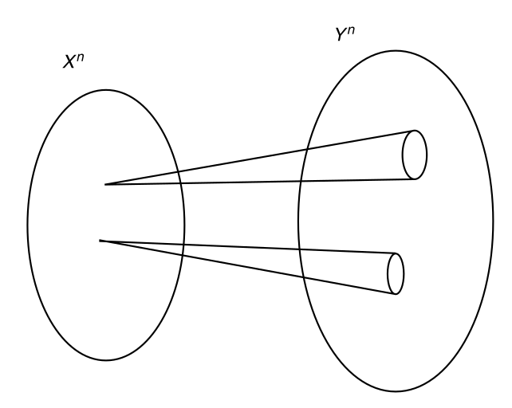
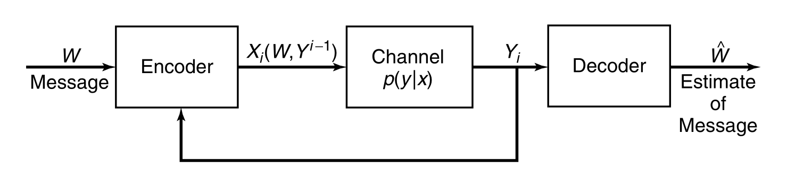
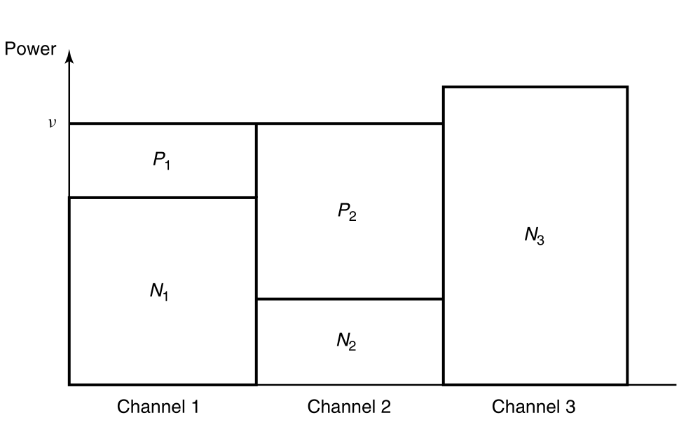

# EE142 Information Theory Course Note part 2: source coding and channel coding

## Source Coding and Data Compression

### Terminologies

- source: a discrete-time integer-valued stochastic process $X_1,X_2\ldots$
- discrete memoryless source (DMS): $X_1,X_2\ldots\stackrel{iid}{\sim} p(X)$
- symbol: let $\mathcal{X}$ be the support of $X_i$, every $x\in\mathcal{X}$ is called a symbol.
- alphabet: a finite set $D$, most of the time we choose $D=\{0,1\}$ for binary encoding.
- code: $C:\mathcal{X} \to D^*$, maps a symbol to a codeword.
- extension: $C^*:\mathcal{X}^* \to D^*$ where $x_1x_2\cdots x_n \mapsto C(x_1)C(x_2)\cdots C(X_n)$.
- code hierarchy: (strict subset relation)

  1. singular: $\exists x_0,x_1\in\mathcal{X} . x_0\neq x_1 \land C(x_0)=C(x_1)$,
     the code mapping is not injective
  2. non-singular: $\forall x_0,x_1\in\mathcal{X} . x_0\neq x_1\to C(x_0)\neq C(x_1)$,
     the code mapping is injective.
  3. uniquely decodable: $\forall s_0,s_1\in \mathcal{X}^* . s_0\neq s_1 \to C^*(s_0)\neq C^*(s_1)$,
     the extension mapping is injective.
  4. prefix-free: $\forall x_0,x_1\in\mathcal{X} . x_0\neq x_1 \to \lnot \operatorname{prefix}(C(X_0),C(X_1))$
     where $\operatorname{prefix}(x,y)$ determines if $x$ is a prefix of $y$.

- Simply algorithm to determine uniquely decodable codes:  
  Idea: The code is not uniquely decodable iff exists codewords $a_1\ldots a_p, x_1\ldots x_q, y_1\ldots y_r$ where $x_1\neq y_1$, such that $a_1 a_2\ldots a_p x_1 x_2 \ldots x_q = a_1 a_2 \ldots a_p y_1 y_2 \ldots y_r$.
  When the common prefix is removed, the condition is reduced to $x_1\ldots x_q = y_1\ldots y_r$ for $x_1\neq y_1$.

  1. Enumerate pairs $a,b\in\mathcal{X}$ that $a\neq b$.
  2. Construct two regular expression
     $$
     r_a = C(a) \circ {\left( \bigcup_{x\in\mathcal{X}} C(x)\right)}^*
     \quad
     r_b = C(b) \circ {\left( \bigcup_{x\in\mathcal{X}} C(x)\right)}^*
     $$
  3. Reject if $r_a\cap r_b \neq \varnothing$
  4. Accept the code $C(x)$

- Efficient algorithm for determine uniquely decodability [Sardinas–Patterson algorithm - Wikipedia](https://en.wikipedia.org/wiki/Sardinas–Patterson_algorithm)
- code length: $l:\mathcal{X}\to\mathbb{N}$ where $l(x)=|c(x)|$.
- expected length: $L(C)=\mathbb{E}\left[l(X)\right]=\sum_x p(x)l(x)$.

The task of source coding is:

1. Given a DMS that generates symbols from PMF $p(X)$.
2. Design a code $C(X)$ that is prefix-free or uniquely decodable.
3. Find $C(X)$ that minimizes $L(C)$.

### Fixed-length Code

Use $L$ bits to encode every symbol.

$$
D^L \geq |\mathcal{X}|
\implies
L=\lceil \log_D |\mathcal{X}|\rceil < \log_D |\mathcal{X}| + 1
$$

Block coding: Every $n$ symbols forms a group. Use $L$ bits to encode groups.

$$
D^L \geq |\mathcal{X}^n|
\implies
L=\lceil n\log_D |\mathcal{X}|\rceil < n\log_D |\mathcal{X}| + 1
$$

The average code length $L(C)=L/n$

$$
\log_D \mathcal{X} \leq \frac{L}{n} < \log_D |\mathcal{X}| + \frac{1}{n}
\implies
\lim_{n\to\infty} L(C) = \log_D |\mathcal{X}|
$$

### Variable-length Code

Preliminary

- WLOG, let $D=\{0,1,2,\ldots,|D|-1\}$.
- [Trie - Wikipedia](https://en.wikipedia.org/wiki/Trie)

Every code $C:\mathcal{X} \to D^*$,
can be represented by a $|D|$-ary trie structure the codewords $\{C(x) \mid x\in \mathcal{X}\}$.

The prefix tree of prefix-free codes:  

- For every symbol $x\in\mathcal{X}$,
  the path from the root node to $C(x)$ contains no other codewords.
- For every symbol $x\in\mathcal{X}$,
  the sub tree of $C(x)$ contains no other codewords.

A quantitative description of the prefix-free property give rise to the Kraft inequality.

### Kraft–McMillan Inequality

For a code $C$ and its codewords trie $T$,
assign an interval $[l_u,r_u]$ for every node $u\in T$.

1. Assign $[0,1]$ for the root of the tree.
2. If $[l_u,r_u]$ is assigned to $u$,
   then assign $\left[l_u+\frac{k}{|D|}(r_u-l_u), l_u+\frac{k+1}{|D|}(r_u-l_u)\right]$ to $\operatorname{child}(u,k)$.  
   That is: evenly divide the interval into $|D|$ segments, assign them to children.

If $C$ is prefix-free,
the intervals assigned to codeword nodes cover a subset of $[0,1]$.  
The interval of a node at depth $d$ is of length ${|D|}^{-d}$.  
Therefore:

$$
\sum_{x\in \mathcal{X}} {|D|}^{-l(x)} \leq 1
$$

The equality hold if and only if the intervals of codeword nodes form a partition of $[0,1]$.
Or equivalently, the codewords trie is a full $D$-ary tree.

- prefix code implies Kraft Inequality hold
- Kraft inequality hold, a prefix code exists.

The converse of this inequality is also hold:  

Suppose that for $l_1,l_2,\ldots,l_n$

$$
\sum_{i=1}^{n} {|D|}^{-l_i} \leq 1
$$

Then a $|D|$-ary prefix-free code $C:\{1,2,\ldots,n\}\to D$ can be constructed.

**Caveat**:
It is possible that $l(x_1),l(x_2)\ldots l(x_n)$ satisfy the kraft inequality
yet the code $C(x_1),C(x_2)\ldots C(x_n)$ is not prefix-free.

**Extension**: For uniquely decodable codes,
Kraft inequality and code existence theorem are also true.

See [Kraft–McMillan inequality - Wikipedia](https://en.wikipedia.org/wiki/Kraft–McMillan_inequality).  
See [Segment tree - Wikipedia](https://en.wikipedia.org/wiki/Segment_tree) for more insight into the Kraft inequality.

### Lower Bound of Source Coding (DMS)

- A DMS that generate $X\sim p(X)$ from $\{1,2,\ldots,m\}$
- The code alphabet is $\{1,2,\ldots,D\}$
- The codeword length are $l_i=|c(i)|$

Use Lagrange multiplier to find the lower bound of expected code length.  
See [Lagrange multiplier - Wikipedia](https://en.wikipedia.org/wiki/Lagrange_multiplier).

$$
\text{minimize} \sum_{i=1}^{n} p_i l_i
\quad
\text{subject to} \sum_{i=1}^{n} D^{-l_i} = 1
$$

Construct the Lagrangian function:

$$
\mathcal{L}(\vec{l},\lambda) = \sum_{i=1}^{n} p_i l_i - \lambda \left(\sum_{i=1}^{n} D^{-l_i} -1\right)
$$

Let

$$
\begin{cases}
\frac{\partial}{\partial l_i} \mathcal{L}(\vec{l},\lambda) = p_i + \lambda D^{-l_i}\ln D = 0 \\
\sum_{i=1}^{n} D^{-l_i} = 1
\end{cases}
$$

The solution is

$$
\begin{cases}
\lambda = -\frac{1}{\ln D} \\
l_i = - \log_D p_i = \log_D \frac{1}{p_i}\\
\end{cases}
\implies
L^\ast = \sum_{i=1}^{n} p_i \log_D \frac{1}{p_i} = H_D(X)
$$

In DMS source coding, the lower bound of expected code length is the entropy of the source.  
Such lower bound can be achieved if and only if $l_i = -\log_D p_i$ is an integer for every symbol $i$.

Consider the difference between expected code length and entropy:

$$
\begin{aligned}
L(C) - H_D(X)
&= \sum_{i=1}^{n} p_i l_i - \sum_{i=1}^{n} p_i \log_D \frac{1}{p_i}\\
&= \sum_{i=1}^n p_i \log_D D^{l_i} + \sum_{i=1}^{n} p_i \log_D p_i\\
&= \sum_{i=1}^n p_i \log_D \frac{p_i}{D^{-l_i}}\\
\end{aligned}
$$

Let $S = \sum_{j=1}^{n} D^{-l_i}\leq 1$, $q_i = D^{-l_i}/S$

$$
\begin{aligned}
L-H
&= \sum_{i=1}^n p_i \log_D \left( \frac{p_i}{q_i} \cdot \frac{1}{S}\right)\\
&= \sum_{i=1}^n p_i \log_D \frac{p_i}{q_i} + \sum_{i=1}^{n} p_i \log_D \frac{1}{S}\\
&= D_{KL}(p||q) + \log_D \frac{1}{S}\\
&\geq 0
\end{aligned}
$$

Equality hold iff $p_i=q_i \land S=1$, that is $p_i=D^{-l_i}$.

### Roof/Ceil Code

For $p(X) = (p_1,p_2,\ldots,p_n)$.
$l_i^\ast = -\log_D p_i$ might not be an integer.
Round it to roof/ceiling by letting $l_i = \lceil -\log_D p_i \rceil$.

Verify that these code length satisfies the Kraft inequality.

$$
\sum_{i=1}^n D^{-l_i}
=\sum_{i=1}^n D^{-\lceil -\log_D p_i \rceil}
\leq \sum_{i=1}^n D^{\log_D p_i}
= \sum_{i=1}^n p_i = 1
$$

The expected code length is

$$
L_{ceil}=\sum_{i=1}^n p_i \lceil -\log_D p_i \rceil
< \sum_{i=1}^n p_i (-\log_D p_i + 1)
= H_D(X) + 1
$$

The expected code length of roof/Ceil code gives a upper bound of optimal code length.

$$
H_D(X) \leq L^\ast \leq H_D(X) + 1
$$

- lower bound: relaxed source coding problem, non-integer code length solutions are allowed
- upper bound: roof/ceil code length

Similar to the case for Fixed-length code,
by grouping every $k$ symbols to gether

$$
k H_D(X) \leq L_{ceil} \leq k H_D(X) + 1
\implies
L_{ceil} \leq H_D(X) + \frac{1}{k}
$$

which converges to $H_D(X)$ i.e., the lower bound of DMS source coding.

#### See also

- [Shannon coding - Wikipedia](https://en.wikipedia.org/wiki/Shannon_coding)
- [Shannon-Fano-Elias coding - Wikipedia](https://en.wikipedia.org/wiki/Shannon–Fano–Elias_coding)

### Huffman Code

Huffman code finds the optimal integer solution of source coding problem

$$
\text{minimize} \sum_{i=1}^{n} p_i l_i
\quad
\text{subject to} \sum_{i=1}^{n} D^{-l_i} = 1
\quad
\text{where}\ l_i \in \mathbb{N}
$$

#### Huffman Tree Algorithm

$D$-ary Huffman tree construction gives a $D$-ary full tree which has $1+k(D-1)$ nodes.  
So the number of symbols $n$ must satisfy $n \equiv 1 \pmod {D-1}$.  
Add zero probability dummy symbols to make sure $n \equiv 1\pmod{D-1}$.

1. Combine $D$ symbols of least probability to form a super-symbol.
2. Repeat step 1 until only one super symbol remains.
3. Assign codewords for each leaf node i.e., all the word nodes.

#### Optimality of Huffman Code

Here we present a proof of optimality of binary Huffman code,
this proof can be extended for showing optimality of $D$-ary Huffman code, 

WLOG, suppose that the probability of each symbol is $p_1 \geq p_2\cdots \geq p_n$,
the codeword length is $l_1,l_2,\ldots,l_n$.

Basic observations: exists a optimal code such that

- If $p_i > p_j$ then $l_i \leq l_j$
- The longest two codewords are of the same length, $l_n = l_{n-1}$
- The two longest codewords differ only in the last bit and correspond to the two least likely symbols. (The codeword Trie is full)

A proof of optimality by induction

1. Only one symbol, Huffman code is optimal
2. Suppose that Huffman code is optimal for $n$ symbols.  
   For $n+1$ symbols. Let $l'=l_n-1=l_{n+1}-1$
   $$
   \begin{aligned}
   L_{n+1}
   &= \sum_{i=1}^{n-1} p_i l_i + p_n l_n + p_{n+1} l_{n+1}\\
   &= \sum_{i=1}^{n-1} p_i l_i + (p_n + p_{n+1}) l' + (p_n+p_{n+1})
   \end{aligned}
   $$
   So the optimal code length for $(p_1,p_2,\ldots,p_n,p_{n+1})$
   is no less than sum of the optimal code length for $(p_1,p_2,\ldots p_n + p_{n+1})$ and $(p_n,p_{n+1})$.  
   The optimal code for $(p_1,p_2,\ldots p_n+p_{n+1})$ can be found with Huffman code by induction hypothesis.  
   Thus, by replacing the codeword $x=C_n(p_n+p_{n+1})$ with $C_{n+1}(p_n) = 0x$ and $C_{n+1}(p_{n+1})=1x$, an optimal code for $(p_1,p_2,\ldots p_n,p_{n+1})$ can be constructed.
3. By induction, Huffman code is an optimal for any number of symbols.

The (asymptotic) compression limit $H(X)$ can be achieved by combining block coding and Huffman code.

### Universal Codes

See [Lempel–Ziv–Welch - Wikipedia](https://en.wikipedia.org/wiki/Lempel–Ziv–Welch)

## Channel Coding and Error Correction

### Terminologies

- source message $W$: a number in $[1:2^{nR}] = \{1,2,\ldots,2^{nR}\}$.  
  Common assumption for simplification: $W\sim \mathrm{DUnif}[1:2^{nR}]$.  
  If the source message is sampled from a non-uniform distribution of entropy $R=H(W)$,
  we can encoded $W$ with $R$ fair coin tosses ($R$ bits). The result should have uniform distribution.
- source encoder: $[1:2^{nR}]\to \mathcal{X}^n$, encodes a source message into a fixed length sequence (the codeword).

  - block length $n$.
  - codebook: source encoder is often deterministic, denoted by $X^n(1),X^n(2), \ldots, X^{n}(2^{nR})$,
    where $X^n(k) = (X_1(k),X_2(k),\ldots X_n(k))$ for $k=1,2,\ldots 2^{nR}$.
  - transmission rate $R$: the (expected) number of bits transmitted by sending/receiving one symbol.  
    The information in source message is $H(W)=\log 2^{nR}=nR$.  
    A codeword $X^n(W)$ carries $nR$ bits with $n$ symbols.
    So the average information transmitted by sending one symbol $X\in \mathcal{X}$ is $R$.

- channel: $(\mathcal{X},p(Y^n|X^n),\mathcal{Y})$. The receiver end gets $Y^n\sim P(Y^n|X^n)$ when $X^n$ is send through the channel.  
  Often composed of a modulator, a noisy analog channel and a demodulator.
- memoryless channel: $p(Y_k|X_1\ldots X_k,Y_1\ldots Y_{k-1}) = p(Y_k|X_k)$.  
  That is output $Y_k$ only related to $X_k$.  
  Implication: $p(Y^n|X^n) = \prod_{i=1}^{n} p(Y_i|X_i)$
- source decoder: An estimator $\hat{W}$ estimating $W$ using $Y^n$.

The Markov chain (randomness comes from the noisy channel):

$$
W\to X^n \to Y^n \to \hat{W}
$$

- conditional probability of error: $\lambda_k^{(n)}=\Pr(\hat{W} \neq k | W=k)$

  $$
  \begin{aligned}
  \lambda_k^{(n)}
  &= \sum_{y^n\in \mathcal{Y}^n} \Pr(\hat{W}\neq k|W=k,Y=y^n) p(y^n|X^n(k)) & \\
  &= \sum_{y^n\in \mathcal{Y}^n} \Pr(\hat{W}\neq k|Y=y^n) p(y^n|X^n(k)) & (\text{Markov Chain})\\
  \end{aligned}
  $$

- average probability of error: $P_e^{(n)} = \frac{1}{2^{nR}}\sum_{k=1}^{2^{nR}} \lambda_k$
- maximal probability of error: $\lambda^{(n)} = \max_{k\in [1:2^{nR}]} \lambda_k^{(n)}$
- achievable rate: rate at which asymptotically error-free code is possible.  
  That is, exists a codebook $X^n:[1:2^{nR}]\to \mathcal{X}^n$,
  such that $\lambda^{(n)} \to 0$ as $n\to \infty$.  
  Or equivalently, a transmission rate $R$ is achievable
  if the error rate $\lambda^{(n)}$ can be arbitrarily small for sufficiently large block length $n$.
- channel capacity: supremum of achievable rate. $C=\{R\in \mathbb{R}\mid R\ \text{achievable}\}$

### Capacity of Discrete Memoryless Channels (DMC)

We will show it latter that 
channel capacity of a DMC $p(y|x)$ is 

$$
C=\max_{p(x)} I(X;Y)
$$

**Interpretation:** Consider a $(2^{nR},n)$ code transmitting $R$ bits per symbol.

1. The total number of possible received sequences is $|A^{(n)}_{\epsilon}(Y)| = 2^{nH(Y)}$.
2. When the input $X^n$ is known the number of possible received sequences is $|A^{(n)}_{\epsilon}(Y|X)|\approx 2^{nH(Y|X)}$.
3. For error-free decoding, partition $A^{(n)}(Y)$ into subsets of $2^{nH(Y|X)}$ elements.
4. Distinguishable sequences $2^{nH(Y)} / 2^{nH(Y|X)} = 2^{n(H(Y)-H(Y|X))} = 2^{n I(X;Y)}$.
5. Can carry $\log 2^{n I(X;Y)} = nI(X;Y)$ bits. So $R \leq \max_{p(x)} I(X;Y)$

#### Noisy Typewriter

- Input $\mathcal{X}=\{a,b,c,\ldots z\}$
- Output $\mathcal{Y}=\{a,b,c,\ldots z\}$
- Noise $\Pr(Y=i|X=i)=\Pr(Y=i+1|X=i)=\frac12$

$$
\begin{aligned}
I(X;Y)
&=H(Y) - H(Y|X)\\
&=H(Y) - \sum_{x\in\mathcal{X}} H(Y|X=x)\Pr(X=x)\\
&=H(Y) - \sum_{x\in\mathcal{X}} 1\cdot \Pr(X=x)\\
&=H(Y) - 1\\
&\leq \log |\mathcal{Y}| - 1 = \log 26 - 1 = \log 13
\end{aligned}
$$

Upper bound achieved only if $Y$ is uniformly random:  
Let $\Pr(Y=i) = \frac{1}{26} = \frac12 \Pr(X=i) + \frac12 \Pr(X=i-1)$ for $i=1,2,\ldots 26$.  
The solution is $\Pr(X=i) = \frac{1}{26}$.

Optimal channel code:

- Source Message $\{1,2,3,\ldots 13\}$
- Send $1\to a,2\to c,3\to e,4\to g,\ldots 13\to y$
- Decode $\{a,b\}\to 1, \{c,d\}\to 2, \{e,f\}\to 3, \{y,z\}\to 13$

#### Binary Symmetric Channel

- Input/Output $\mathcal{X}=\mathcal{Y}=\{0,1\}$.
- Crossing probability $p$, $p(1|0)=p(0|1)=p$. That is: flip with probability $p$.
- Alternative modeling $Y=X\oplus Z$ where $Z\sim\mathrm{Bern}(\frac12)$, $\oplus$ is the binary exclusive-or (xor).

$$
\begin{aligned}
I(X;Y)
&=H(Y) - H(Y|X)\\
&=H(Y) - \sum_{x\in\mathcal{X}} H(Y|X=x)\Pr(X=x)\\
&=H(Y) - \sum_{x\in\mathcal{X}} H(p)\cdot \Pr(X=x)\\
&=H(Y) - H(p)\\
&\leq 1 - H(p)
\end{aligned}
$$

Upper bound achieved only if $Y$ is uniformly random:  
Let $\Pr(Y=0)=\frac12 = (1-p)\Pr(X=0) + p\Pr(X=1)$.  
The solution is $\Pr(X=0)=\Pr(X=1)=\frac12$.

Optimal channel code:

- Source message $W\in \{0,1\}$
- Send $X=W$
- Decode if $p\geq\frac12$ then $\hat{X} = Y$, otherwise $\hat{X} = \overline{Y}$.  

This is the maximum posterior estimator (MAP),
also the maximum likelihood estimator (MLE).

**NOTE**: MAP decoding is optimal in general since it minimizes the error probability for every possible source message.  
**NOTE** BSC with crossing probability $\frac12$ is not capable of transmitting any information since $Y\sim \mathrm{Bern}(\frac12)$ regardless of $X$.

#### Binary Erasure Channel

- Input $\mathcal{X}=\{0,1\}$
- Output $\mathcal{Y}=\{0,1,e\}$, $e$ stands for erasure.
- Erasing probability, $p(e|0)=p(e|1)=\alpha$ and $p(0|0)=p(1|1)=1-\alpha$

$$
\begin{aligned}
I(X;Y)
&=H(Y) - H(Y|X)\\
&=H(Y) - \sum_{x\in\mathcal{X}} H(Y|X=x)\Pr(X=x)\\
&=H(Y) - \sum_{x\in\mathcal{X}} H(p)\cdot \Pr(X=x)\\
&=H(Y) - H(p)\\
\end{aligned}
$$

Let $E=\mathbf{1}\left[Y=e\right]$ be the indicator of event $Y=e$,
then $E\sim\mathrm{Bern}(\alpha)$

$$
\begin{aligned}
H(Y) 
&= H(Y,E) \\
&= H(E) + H(Y|E) \\
&= H(\alpha) + (1-\alpha)H(Y|E=0) + \alpha H(Y|E=1)\\
&= H(\alpha) + (1-\alpha)H(p_x) + \alpha \cdot 0\\
&\geq H(\alpha) + (1-\alpha)
\end{aligned}
$$

Thus, the maximum mutual information is $1-\alpha$.  
Achieved when $p_x=(\frac12,\frac12)$.

Optimal transmission protocol:

- Source message $W\in\{0,1\}$
- Send $X=W$ through the channel
- If $Y=e$, resend, otherwise $\hat{X}=Y$.

**NOTE** this protocol relies on _feedback_ (the transmitter can determine whether the receiver gets an erasure or not).

#### Symmetric Channels

Transition matrix: $A_{x,y} = p(y|x)$ whose shape is $|\mathcal{X}| \times |\mathcal{Y}|$.

- symmetric: each row is a permutation, each column is a permutation.
- weakly symmetric: each row is a permutation, sum of each column is equal

$$
\begin{aligned}
I(X;Y)
&= H(Y) - H(Y|X)\\
&= H(Y) - \sum_{x\in\mathcal{X}} H(Y|X=x) \Pr(X=x)\\
&= H(Y) - \sum_{x\in\mathcal{X}} H(p(\ast|x)) \Pr(X=x)\\
&= H(Y) - \sum_{x\in\mathcal{X}} H(A_{x,1},A_{x,2},\ldots) \Pr(X=x)\\
&= H(Y) - H(A_{x,1},A_{x,2},\ldots)\\
\end{aligned}
$$

If $X\sim\mathrm{DUnif}(\mathcal{X})$, then

$$
p(y)
= \sum_{x\in\mathcal{X}}p(y|x)p(x)
= \frac{1}{|\mathcal{X}|}\sum_{x\in\mathcal{X}} p(y|x)
= \frac{1}{|\mathcal{X}|}\sum_{x\in\mathcal{X}} A_{x,y}
$$

The marginal distribution of $Y$ is a uniform distribution if the marginal distribution of $X$ is a uniform distribution.  
By selecting a uniformly random $X$, the maximal mutual information is achieved.

### Selection of Channels

#### Construction

For two DMCs 
$c_1=(\mathcal{X}_1,p_1(y|x),\mathcal{Y}_1)$
and
$c_2=(\mathcal{X}_2,p_2(y|x),\mathcal{Y}_2)$,  
where 
$\mathcal{X}_1\cap \mathcal{X}_2=\emptyset$
and
$\mathcal{Y}_1\cap \mathcal{Y}_2=\emptyset$.  
Then $c_1\cup c_2=(\mathcal{X},p(y|x),\mathcal{Y})$ can be defined as

$$
\mathcal{X} = \mathcal{X}_1 \cup \mathcal{X}_2
\quad
\mathcal{Y} = \mathcal{Y}_1 \cup \mathcal{Y}_2
\quad
p(y|x) = \begin{cases}
p_1(y|x) & (x,y) \in (\mathcal{X}_1,\mathcal{Y}_1)\\
p_2(y|x) & (x,y) \in (\mathcal{X}_2,\mathcal{Y}_2)\\
0 & \text{otherwise}
\end{cases}
$$

This is called selection of channels.  
The capacity of $c_1\cup c_2$ is $C$ where

$$
2^C = 2^{C_1} + 2^{C_2}
$$

#### Capacity

Consider the variable depicting the channel used:

$$
S=\begin{cases}
1 & (x,y)\in (\mathcal{X}_1,\mathcal{Y}_1)\\
2 & (x,y)\in (\mathcal{X}_2,\mathcal{Y}_2)\\
\end{cases}
$$

Suppose that $p(S) = (\beta,1-\beta)$ and $S$ is fully determined by $X$ or $Y$:

$$
\begin{aligned}
H(Y)
&= H(S,Y)\\
&= H(S) + H(Y|S)\\
&= H(\beta) + H(Y|S)\\
H(Y|X)
&= H(Y,S|X)\\
&= H(S|X) + H(Y|S,X)\\
&= 0+H(Y|S,X)\\
&= H(Y|S,X)\\
I(X;Y)
&= H(Y) - H(Y|X)\\
&= H(\beta) + H(Y|S) - H(Y|S,X)\\
&= H(\beta) + I(X;Y|S) \\
&= H(\beta) + \beta I(X;Y|S=1) + (1-\beta)I(X;Y|S=2)\\
&\leq H(\beta) + \beta C_1 + (1-\beta) C_2
\end{aligned}
$$

The upperbound is achieved when the following conditions are satisfied

- $p(x|S=1)$ is the distribution that maximizes $I(X_1,Y_1)$ (optimal channel code for $C_1$).
- $p(x|S=2)$ is the distribution that maximizes $I(X_2,Y_2)$ (optimal channel code for $C_1$).

Let $g(x) = H(x) + x C_1 + (1-x) C_2$ for $x\in \left[0,1\right]$, we shall find the maximum of $g(x)$.

$$
\begin{aligned}
\frac{\mathrm{d}}{\mathrm{d}x} g(x)
&=-\frac{\ln x + 1}{\ln 2} + \frac{\ln (1-x) + 1}{\ln 2} + (C_1 - C_2)\\
\frac{\mathrm{d}^2}{\mathrm{d}x^2} g(x)
&=-\frac{1}{x\ln 2} - \frac{1}{(1-x)\ln 2} < 0\\
\end{aligned}
$$

Thus, the point $x_0$ such that $g'(x_0)=0$ maximizes $g(x)$

$$
0=\frac{-\ln x + \ln (1-x)}{\ln 2} + (C_1 - C_2)
\implies
x_0 = \frac{2^{C_1}}{2^{C_1}+2^{C_2}}
$$

The maximum $g(x)$ is

$$
\begin{aligned}
g(x_0)
&=\frac{2^{C_1}}{2^{C_1}+2^{C_2}} \log \frac{2^{C_1}+2^{C_2}}{2^{C_1}}
+\frac{2^{C_2}}{2^{C_1}+2^{C_2}} \log \frac{2^{C_1}+2^{C_2}}{2^{C_2}}
+C_1 \frac{2^{C_1}}{2^{C_1}+2^{C_2}}
+C_2 \frac{2^{C_2}}{2^{C_1}+2^{C_2}}\\
&=\frac{2^{C_1}+2^{C_2}}{2^{C_1}+2^{C_2}}\log (2^{C_1} + 2^{C_2})
+\frac{-C_1 2^{C_1}-C_2 2^{C_2}}{2^{C_1}+2^{C_2}}
+C_1 \frac{2^{C_1}}{2^{C_1}+2^{C_2}}
+C_2 \frac{2^{C_2}}{2^{C_1}+2^{C_2}}\\
&=\log (2^{C_1}+2^{C_2})
\end{aligned}
$$

Therefore, the maximum mutual information i.e., the channel capacity of $c_1\cup c_2$, satisfies

$$
C=\log (2^{C_1}+2^{C_2})
\qquad
2^{C} = 2^{C_1}+2^{C_2}
$$

### Channel Coding Theorem

> Also known as Shannon's second theorem

For discrete memoryless channel $(\mathcal{X},p(y|x),\mathcal{Y})$,
the channel capacity is $C=\max_{p(x)} I(X;Y)$,
where $p(x)$ is a distribution on $\mathcal{X}$ and $p(x,y)=p(x)p(y|x)$.

#### Rate lower than capacity is achievable

**Idea** random codebook

Consider the following transmission protocol: random code and joint typicality decode.

1. Find $p(x)$ that maximize the input-output mutual information.
2. Generate $2^{nR}$ codewords of length $n$ according to i.i.d. $p(x)$  
   Compose them into a codebook $X^n(1),X^n(2),\ldots,X^n(2^{nR})$.
3. On source message $W\in [1:2^{nR}]$, send $X^n(W)$ over the channel.
4. On receiving $Y^n$, find $\hat{W}=g(Y^n)=k$ such that $(X^n(k),Y^n)\in A^{(n)}_{\epsilon}(X,Y)$.  
   If no such codeword can be found or at least two codewords satisfies the condition, declare an error.

Consider the condition probability of error

$$
\lambda^{(n)}_i
= \Pr(g(Y^n)\neq i | X^n=X^n(i))
= \sum_{y^n\in\mathcal{Y}^n: g(y^n)\neq i} p(y^n|X^n(i))
\qquad i\in [1:2^{nR}]
$$

For simplicity, consider the case for $i=1$.

There are two types of error (not disjoint) in the transmission

- $(X^n(1),Y^n)$ is not jointly typical.  
  $X^n(1)$ is generated according to $p(x^n)$ and $Y^n$ is generated according to $p(y^n|X^n(1))$.  
  Therefore $(X^n(1),Y^n) \sim p(x^n)p(y^n|x^n) = p(x^n,y^n)$,  
  thus $(X^n(1),Y^n)\in A^{(n)}_{\epsilon}(X,Y) \geq 2^{-n(H(X,Y)+\epsilon)}$
- exists $j\neq 1$ such that $(X^n(j),Y^n)$ is jointly typical.  
  $X^n(j)$ is generated according to $p(x^n)$ while $Y^n$ is generated according to $p(y^n|X^n(1))$.
  $X^n(1)$ is independent of $X^n(j)$ so the distribution of $Y^n$ is simply $p(y^n)$.  
  Therefore $(X^n(j),Y^n) \sim p(x^n)p(y^n)$,  
  thus $(X^n(j),Y^n)\in A^{(n)}_{\epsilon}(X,Y) \leq 2^{-n(I(X,Y)-3\epsilon)}$

Let $E_1,E_2,\ldots E_{2^{nR}}$ be the event that $(X^n(1),Y^n)\in A^{(n)}_{\epsilon}(X,Y)$.

$$
\begin{aligned}
\lambda_1^{(n)} 
&= \Pr(\bar{E_1}\cup E_2\cup E_3\cdots E_{2^{nR}})\\
&\leq \Pr(\bar{E_1}) + \sum_{j=2}^{2^{nR}} \Pr(E_i)\\
&\leq 2^{-n(H(X,Y)+\epsilon)} + (2^{nR}-1) 2^{-n(I(X;Y)-3\epsilon)}\\
&\leq 2^{-n(H(X,Y)+\epsilon)} + 2^{-n(I(X;Y)-R-3\epsilon)}\\
\end{aligned}
$$

If $I(X;Y)\geq R+3\epsilon$, then $\lambda_1^{(n)}\to 0$.  
The overall error probability $P_e^{(n)} = \frac{1}{2^{nR}} \sum_{i=1}^{2^{nR}} \lambda_i^{(n)} = \lambda_1^{(n)}$ also converges to $0$.

Asymptotically error-free is guaranteed if $R\leq \max I(X;Y)$.

#### Rate greater than capacity is impossible

**Idea** Fano's inequality

Recall: Fano's inequality is stated as follows:  
If $X\to Y\to \hat{X}=g(Y)$,
then $H(X|Y)\leq H(P_e) + P_e \log |\mathcal{X}|$.  

This can be weaken to $P_e \geq \frac{H(X|Y)-1}{\log |\mathcal{X}|}$

Since the source message is uniformly random generated from $[1:2^{nR}]$, $H(W) = nR$.  
Apply Fano's inequality

$$
\begin{aligned}
P_e^{(n)}
&= \Pr(W\neq \hat{W}) \\
&\geq \frac{H(W|\hat{W}) - 1}{\log 2^{nR}}\\
&= \frac{H(W|\hat{W})-1}{nR}\\
&= \frac{H(W) - I(W;\hat{W}) - 1}{nR}\\
&\geq \frac{H(W) - I(X^n;Y^n) - 1}{nR}\\
&=1 - \frac{I(X;Y)}{R} - \frac{1}{nR}\\
\lim_{n\to\infty} P_e^{(n)}
&\geq \lim_{n\to\infty}\left(1 - \frac{I(X;Y)}{R} - \frac{1}{nR}\right)
=1 - \frac{I(X;Y)}{R}
\end{aligned}
$$

To make sure that $P_e^{(n)}\to 0$, $R \leq \max I(X;Y)$ must be true.  
Otherwise $P^{(n)}_e$ will converge to a positive real number.  
So any $R>\max I(X;Y)$ is not achievable.

### Forward Error Correction Codes

The goal of channel code is to add redundancy for error detection and correction.  
Research on channel codes (or forward error correction code) grows into the field of _coding theory_

Classical results:

- Hamming ECC Code
- Reed-Muller Code
- BCH Code
- Reed-Solomon Erasure Code
- Low Density Parity Check (LDPC)
- Turbo code
- Polar Code

### Point-to-Point DMC with Feedback

#### Modeling

Feedback:
A received symbol $Y_i$ is send back to the transmitter immediately noiselessly.
The transmitter decide next symbol to send based on the source message and the feedback symbol.

#### Condition for error-free decode

Apply the Fano's inequality to find lower bound of the error probability $P_e^{(n)}$

$$
\begin{aligned}
H(W|\hat{W}) &\leq H(P_e^{(n)}) + P_e^{(n)} \log |\mathcal{W}|\\
P_e^{(n)} &\geq \frac{H(W|\hat{W}) - 1}{nR}\\
&=\frac{H(W)-I(W;\hat{W})-1}{nR}\\
&=1-\frac{1}{nR} - \frac{I(W;\hat{W})}{nR}\\
\lim_{n\to\infty} P_e^{(n)} &\geq 1 - 0 - \frac{I(W;\hat{W})}{nR}
\end{aligned}
$$

Now consider the lower bound of $I(W;\hat{W})$

$$
\begin{aligned}
I(W;\hat{W}) & \leq I(W;Y^n)\\
&=H(Y^n) - H(Y^n|W)\\
&=H(Y^n) - \sum_{i=1}^n H(Y_i|Y_1\ldots Y_{i-1},W)\\
&=H(Y^n) - \sum_{i=1}^n H(Y_i|Y_1\ldots Y_{i-1},W,X_i)\\
&=H(Y^n) - \sum_{i=1}^n H(Y_i|X_i)\\
&\leq \sum_{i=1}^n H(Y_i) - \sum_{i=1}^n H(Y_i|X_i)\\
&=\sum_{i=1}^n I(X_i;Y_i)\\
&\leq nC
\end{aligned}
$$

Two key steps in the derivation
- $H(Y_i|Y_1\ldots Y_{i-1},W) = H(Y_i|Y_1\ldots Y_{i-1},W,X_i)$ since $X$ is determined by $(Y_1\ldots Y_{i-1},W)$.
- $H(Y_i|Y_1\ldots Y_{i-1},W,X_i) = H(Y_i|X_i)$ since $Y_i$ is conditionally independent of previous $Y$ and $W$ when given $X_i$.

Finally, combine the two bounds: $\lim_{n\to\infty} P_e^{(n)} \geq 1 - \frac{C}{R}$.
To achieve asymptotically zero error probability, $R\leq C$ has to be satisfied.

#### Interpretation

For point-to-point DMC, introducing feedback cannot improve the capacity.
With that said having a feedback does bring some advantages:

- feedback can simplify the communication protocol
- feedback can improve the rate at which $\lambda^{(n)}\to 0$

In non-classic information settings such as broadcasting and MIMO, feedback can improve the capacity.

### Source Channel Separation Theorem

Theorem statement

- For a discrete-time integer-valued stochastic process $V^n$.
- Send $V^n$ through a discrete memoryless channel.
- At asymptotically zero error probability.
- This is possible if and only if $C\geq \lim_{n\to\infty} \frac{H(V^n)}{n}$.
- That is error-free is possible iff entropy rate is bounded by channel capacity.

Proof sketch

- Achievable: Combining _source coding theorem_ and  _noisy channel coding theorem_.  
  That is: Huffman coding + random code with joint typicality decoder.
- Converse: Apply Fano's inequality. Establish bound on input-output mutual information.

## Gaussian Channel

### Rational of Gaussian Model

The central limit theorem (CLT) state that:  
For a sequence of independent and identically distributed $X_1,X_2,\ldots$
where $\mathbb{E}X=\mu, \operatorname{Var}(X)=\sigma^2$

$$
\bar{X}_n = \frac{1}{n}\sum_{i=1}^{n} X_i
\quad
\sqrt{n} (\bar{X}_n - \mu) \to \mathcal{N}(0,\sigma^2)
$$

WLOG, let $\mathbb{E}X=0,\mathbb{E}X^2=1$. Let $M(t)=\mathbb{E}(e^{tX})$ be the MGF of $X$.

$$
\begin{aligned}
M(t)
&=\mathbb{E}(e^{tX}) 
=\mathbb{E}\left[\sum_{i=0}^{\infty} \frac{{(tX)}^n}{n!}\right]

=\sum_{i=0}^{\infty} \frac{t^n}{n!} \mathbb{E}(X^n)\\
e^{t \sqrt n (\bar{X}_n - \mu) }
&=e^{\sum_{i=1}^n \frac{t}{\sqrt n} X_i}
=\prod_{i=1}^n e^{\frac{t}{\sqrt n} X_i}\\
\mathbb{E}\left[ e^{t \sqrt n (\bar{X}_n - \mu) } \right]
&=\mathbb{E}\left[ \prod_{i=1}^n e^{\frac{t}{\sqrt n} X_i} \right]
=\prod_{i=1}^n \mathbb{E}\left[  e^{\frac{t}{\sqrt n} X_i} \right]
=\prod_{i=1}^n M\left(\frac{t}{\sqrt n} \right)
=M^n\left(\frac{t}{\sqrt n} \right)\\
&\to {\left(
M(0) + \frac{t}{\sqrt n}M'(0) + \frac{t^2}{n} \frac{M''(0)}{2} + o(t^2/n)
\right)}^n\\
&\to {\left( 1 + \frac{t^2}{2n} \right)}^n
={\left( 1 + \frac{t^2}{2n} \right)}^{\frac{2n}{t^2} \cdot \frac{t^2}{2}}
=\operatorname{power}\left(
{\left( 1 + \frac{t^2}{2n} \right)}^{\frac{2n}{t^2}}, \frac{t^2}{2}
\right)\\
&\to e^{t^2/2}
\end{aligned}
$$

This is the $\mathcal{N}(0,1)$ MGF, so $\sqrt{n}(\bar{X}-\mu) \to \mathcal{N}(\mu,\sigma^2)$.  

CLT explains the ubiquity Gaussian models.

### Additive Gaussian White Noise Channel

> also known as AWGN channel

#### Modeling

A channel $X\to Y$ where

- $Y=X+Z$ additive noise
- $Z\sim \mathcal{N}(0,N)$ Gaussian white noise
- $\mathbb{E}[X^2]\leq P$ power limit

#### Theorem (AWGN channel capacity)

$$
C = \frac12 \log \left( 1 + \frac{P}{N} \right)
$$

#### Sphere Packing

When $X^n \in \mathbb{R}^n$ is sent through the channel,
the typical received sequences are $A^{(n)}_{\epsilon}(Y|X)$.  
The volume of the set is $2^{n h(Y|X)}$.  

All typical received sequences are $A^{(n)}_{\epsilon}(Y)$.
The volume of the set is $2^{n h(Y)}$.  

Partition the marginal typical sequences $A^{(n)}_{\epsilon}(Y)$ into disjoint subsets for error-free decode.  
An error occurs if independently generated sequences $(\tilde X,\tilde Y)$ are being jointly typical, which converges to zero.  

Thus, the number of separable outcomes is $2^{n (h(Y)-h(Y|X))} = 2^{n I(X;Y)}$
so $nI(X;Y)$ bits is transmitted per $n$ symbol sent.  
The capacity is $\max I(X;Y)$

#### Intuition

First consider the mutual information shared by $X$ and $Y$

$$
i(X;Y) = h(Y) - h(Y|X) = h(Y) - h(X+Z|X) = h(Y) - h(Z)
$$

$h(Z) = \frac12\log (2\pi e N)$ is fixed.  

Now consider the upperbound of $h(Y)$ (bound entropy with variance)

$$
\begin{aligned}
h(Y)
&\leq \frac12 \log (2\pi e \operatorname{Var}(Y))\\
&=\frac12 \log \left(2\pi e 
\left(
\operatorname{Var}(X) + \operatorname{Var}(Z) + \operatorname{Cov}(X,Z)
\right)
\right)\\
&=\frac12 \log \left(2\pi e 
\left(
\operatorname{Var}(X) + N
\right)
\right)\\
&\leq\frac12 \log \left(2\pi e 
\left( P + N \right)
\right)\\
\end{aligned}
$$

Equality is hold iff $X\sim\mathcal{N}(0,P)$.

And the upperbound of the mutual information is

$$
i(X;Y) = h(Y) - h(Z) \leq \frac12 \log \frac{2\pi e (P+N)}{2\pi e N} = \frac12 \log \left( 1 + \frac{P}{N} \right)
$$

Therefore, the channel capacity is $C = \max_{f(x)} i(X;Y) = \frac12 \log (1+P/N)$.

#### Proof

- Achievable: Similar to noisy channel code theorem for DMC. Random codebook from a truncated Gaussian distribution.
- Converse: Fano's inequality and bound on input-output mutual information.

### Band-limited Gaussian Channel

See [Shannon–Hartley theorem - Wikipedia](https://en.wikipedia.org/wiki/Shannon–Hartley_theorem).

Consider a linear time-invariant system $Y(t) = X(t) + Z(t)$,
where $X(t)$ is $W$ band-limited and $Z(t)$ is a Gaussian process with mean $0$ and power spectrum density $N_0/2$.

Spectrum of $X(t)$ contains no component whose frequency is greater than $W$.

$$
X(\omega) = \mathcal{F}\left[X(t)\right] = \int_{-\infty}^{+\infty} X(t)e^{-j\omega t}\mathrm{d}t
\qquad
\forall \omega . (|\omega| > W \to X(\omega)=0)
$$

The channel is capable of transmitting information at $R$ bits per second where $R\leq C$ and

$$
C = W\log \left( 1 + \frac{P}{W N_0} \right)\quad \text{bits per second}
$$

In $[0,T]$ time interval

- $2W\times T$ samples
- power per sample $\frac{P\times T}{2W \times T}$
- per sample noise power $\frac{2W (N_0/2) \times T}{2W\times T}$
- average SNR (signal to noise ratio) $\frac{P}{N_0 W}$

Thus, the bit rate limit is

$$
\frac{2W\times T \cdot \frac12 \log \left( 1 + \frac{P}{N_0 W} \right)}{T}
=W\log\left( 1 + \frac{P}{N_0 W} \right)
$$

### Parallel Uncorrelated Gaussian Channel

#### Modeling

$n$ parallel independent Gaussian channels working together with constraint on the total transmission power.

- $\vec{Y} = \vec{X} + \vec{Z}$
- $Z_i \sim \mathcal{N}(0,N_i)$ such that $(Z_1,Z_2,\ldots Z_n)$ are independent.
- $\sum_{i=1}^{n} \mathbb{E}(X_i^2) \leq P$

Find

$$
C = \max_{p(x_1,x_2,\ldots x_n): \sum_{i=1}^n \mathbb{E}(X_i^2) \leq P} I(\vec{Y};\vec{X})
$$

#### Water-Filling Solution

We shall use optimal channel code on each parallel channel.
Let $P_i$ be the power allocated for the $i$-th channel.

$$
C(\vec{P}) = \sum_{i=1}^n \frac12\log\left(1+\frac{P_i}{N_i}\right)
\propto \sum_{i=1}^n \ln\left(1+\frac{P_i}{N_i}\right)
$$

Applying Lagrange multiplier to find the maximum value.

$$
\mathcal{L} = \sum_{i=1}^n \ln\left(1+\frac{P_i}{N_i}\right) - \lambda\left( \sum_{i=1}^n P_i - P\right)
$$

Then

$$
0
= \frac{\partial L}{\partial P_i}
= \frac{1}{1+P_i/N_i}\times \frac{1}{N_i} - 2 \lambda
\implies P_i = \max\left( \frac{1}{2\lambda} - N_i, 0 \right)
$$

Let $\nu = \frac{1}{2\lambda}$ then $P_i(\nu) = {(\nu - N_i)}^+$ where ${(x)}^+ = \max(x,0)$.  
Here $\sum_{i=1}^n P_i(\nu)$ is a monotonic function of $\nu$,
so we can use binary search to $\nu_0$ such that $\sum_{i=1}^n P_i(\nu_0) = P$.  
Then the optimal power allocation is $P_i^\ast = {\left(\nu_0 - N_i\right)}^{+}$.

This is called a Water-Filling solution.  
The intuition is that to pour $P$ unit volume water into the container,
the result should be $P_i = {(\nu - N_i)}^{+}$ such that $\sum P_i = P$.

### Parallel Correlated Gaussian Channel

**TODO**

#### Modeling

#### Reducing to Uncorrelated Case

### Parallel Correlated Gaussian Channel with Feedback

**TODO**

## Rate Distortion Theory

### Introduction

Lossy compression is an extension of (asymptotically) error-free source coding,
where the loss in accuracy is measured by a _distortion measure function_.  
Rate distortion theory studies the limit of lossy compression:

- The minimum code length with a constraint on distortion:  
  The rate-distortion function $R(D)$
- The minimum distortion required to achieve a given code length:  
  The distortion-rate function $D(R)$

### Terminologies and Notations

Lossy compression:

- Source $X_1,X_2,\ldots,X_n$ where $X_i\in \mathcal{X}$.  
  Common assumption: the source is memoryless, with PDF $f(x)$ or PMF $p(x)$.
- Encoder: $f:\mathcal{X}^n \to \hat{\mathcal{X}}^n$
- Decoder: $g:\hat{\mathcal{X}}^n\to \mathcal{X}^n$
- Distortion metric function: $d:\mathcal{X}\times\hat{\mathcal{X}}\to \mathbb{R}^{+}$  
    Two common metric of distortion
    - Hamming distortion:
      $\mathcal{X}=\hat{\mathcal{X}}$ and $d(x,\hat{x}) = [x\neq\hat{x}]$.
    - Mean Square Error distortion
      $\mathcal{X},\hat{\mathcal{X}}\subseteq \mathbb{R}$ and $d(x,\hat{x}) = {(x-\hat{x})}^2$.

A rate-distortion pair $(R,D)$ is said to be achievable
if there exists a $(2^{nR},n)$ loosy compression such that
$\mathbb{E}\left[ d(X,\hat{X}) \right] \leq D$
is satisfied.

The main theorem of rate-distortion theory states that 

$$
R(D) = \min_{p(\hat{x}|x): \mathbb{E}\left[ d(X,\hat{X}) \right] \leq D} I(X;\hat{X})
$$

### Quantization

Scalar quantization with $\log M$ bit.

- Source: $U_1,U_2,\ldots$ a random process.  
  Common assumption: $U$ is a memoryless with PDF $f(u)$ or PMF $p(u)$
- Region: $R_1,R_2,\ldots, R_M$ disjoint partition of support of $\mathbb{R}$
- Boundary: $b_0 = -\infty, b_1,b_2,b_2,\ldots b_M, b_{M+1}=+\infty$
- Representation: $a_1,a_2,\ldots a_M$
- Encode: $f: U\to V$ where $f(u) = a_i$ for $u\in R_i$

The MSE is

$$
\mathbb{E}\left[ {(U-V)}^2 \right]
=\sum_{i=1}^M \int f(u) {(u-a_i)}^2 \mathrm{d}u
$$

#### Lloyd-Max Algorithm

#### Entropy Quantization

#### High Rate quantization

The PDF within each quantization region $R_i$ is roughly uniform

$$
f(u) \approx \begin{cases}
\frac{\Pr(u\in R_i)}{\operatorname{Vol}(R_i)} & u \in R_i\\
0 & u \not\in \bigcup_{i=1}^{M} R_i
\end{cases}
$$

The result: uniform quantization.

