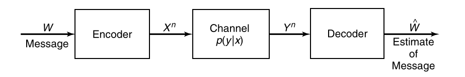

# EE142 Information Theory Course Note part 2: source coding and channel coding

## Source Coding and Data Compression

### Terminologies

- source: a discrete-time integer-valued stochastic process $X_1,X_2\ldots$
- discrete memoryless source (DMS): $X_1,X_2\ldots\stackrel{iid}{\sim} p(X)$
- symbol: let $\mathcal{X}$ be the support of $X_i$, every $x\in\mathcal{X}$ is called a symbol.
- alphabet: a finite set $D$, most of the time we choose $D=\{0,1\}$ for binary encoding.
- code: $C:\mathcal{X} \to D^*$, maps a symbol to a codeword.
- extension: $C^*:\mathcal{X}^* \to D^*$ where $x_1x_2\cdots x_n \mapsto C(x_1)C(x_2)\cdots C(X_n)$.
- code hierarchy: (strict subset relation)

  1. singular: $\exists x_0,x_1\in\mathcal{X} . x_0\neq x_1 \land C(x_0)=C(x_1)$,
     the code mapping is not injective
  2. non-singular: $\forall x_0,x_1\in\mathcal{X} . x_0\neq x_1\to C(x_0)\neq C(x_1)$,
     the code mapping is injective.
  3. uniquely decodable: $\forall s_0,s_1\in \mathcal{X}^* . s_0\neq s_1 \to C^*(s_0)\neq C^*(s_1)$,
     the extension mapping is injective.
  4. prefix-free: $\forall x_0,x_1\in\mathcal{X} . x_0\neq x_1 \to \lnot \operatorname{prefix}(C(X_0),C(X_1))$
     where $\operatorname{prefix}(x,y)$ determines if $x$ is a prefix of $y$.

- Simply algorithm to determine uniquely decodable codes:  
  Idea: The code is not uniquely decodable iff exists codewords $a_1\ldots a_p, x_1\ldots x_q, y_1\ldots y_r$ where $x_1\neq y_1$, such that $a_1 a_2\ldots a_p x_1 x_2 \ldots x_q = a_1 a_2 \ldots a_p y_1 y_2 \ldots y_r$.
  When the common prefix is removed, the condition is reduced to $x_1\ldots x_q = y_1\ldots y_r$ for $x_1\neq y_1$.

  1. Enumerate pairs $a,b\in\mathcal{X}$ that $a\neq b$.
  2. Construct two regular expression
     $$
     r_a = C(a) \circ {\left( \bigcup_{x\in\mathcal{X}} C(x)\right)}^*
     \quad
     r_b = C(b) \circ {\left( \bigcup_{x\in\mathcal{X}} C(x)\right)}^*
     $$
  3. Reject if $r_a\cap r_b \neq \varnothing$
  4. Accept the code $C(x)$

- Efficient algorithm for determine uniquely decodability [Sardinas–Patterson algorithm - Wikipedia](https://en.wikipedia.org/wiki/Sardinas–Patterson_algorithm)
- code length: $l:\mathcal{X}\to\mathbb{N}$ where $l(x)=|c(x)|$.
- expected length: $L(C)=\mathbb{E}\left[l(X)\right]=\sum_x p(x)l(x)$.

The task of source coding is:

1. Given a DMS that generates symbols from PMF $p(X)$.
2. Design a code $C(X)$ that is prefix-free or uniquely decodable.
3. Find $C(X)$ that minimizes $L(C)$.

### Fixed-length Code

Use $L$ bits to encode every symbol.

$$
D^L \geq |\mathcal{X}|
\implies
L=\lceil \log_D |\mathcal{X}|\rceil < \log_D |\mathcal{X}| + 1
$$

Block coding: Every $n$ symbols forms a group. Use $L$ bits to encode groups.

$$
D^L \geq |\mathcal{X}^n|
\implies
L=\lceil n\log_D |\mathcal{X}|\rceil < n\log_D |\mathcal{X}| + 1
$$

The average code length $L(C)=L/n$

$$
\log_D \mathcal{X} \leq \frac{L}{n} < \log_D |\mathcal{X}| + \frac{1}{n}
\implies
\lim_{n\to\infty} L(C) = \log_D |\mathcal{X}|
$$

### Variable-length Code

Preliminary

- WLOG, let $D=\{0,1,2,\ldots,|D|-1\}$.
- [Trie - Wikipedia](https://en.wikipedia.org/wiki/Trie)

Every code $C:\mathcal{X} \to D^*$,
can be represented by a $|D|$-ary trie structure the codewords $\{C(x) \mid x\in \mathcal{X}\}$.

The prefix tree of prefix-free codes:  

- For every symbol $x\in\mathcal{X}$,
  the path from the root node to $C(x)$ contains no other codewords.
- For every symbol $x\in\mathcal{X}$,
  the sub tree of $C(x)$ contains no other codewords.

A quantitative description of the prefix-free property give rise to the Kraft inequality.

### Kraft–McMillan Inequality

For a code $C$ and its codewords trie $T$,
assign an interval $[l_u,r_u]$ for every node $u\in T$.

1. Assign $[0,1]$ for the root of the tree.
2. If $[l_u,r_u]$ is assigned to $u$,
   then assign $\left[l_u+\frac{k}{|D|}(r_u-l_u), l_u+\frac{k+1}{|D|}(r_u-l_u)\right]$ to $\operatorname{child}(u,k)$.  
   That is: evenly divide the interval into $|D|$ segments, assign them to children.

If $C$ is prefix-free,
the intervals assigned to codeword nodes cover a subset of $[0,1]$.  
The interval of a node at depth $d$ is of length ${|D|}^{-d}$.  
Therefore:

$$
\sum_{x\in \mathcal{X}} {|D|}^{-l(x)} \leq 1
$$

The equality hold if and only if the intervals of codeword nodes form a partition of $[0,1]$.
Or equivalently, the codewords trie is a full $D$-ary tree.

- prefix code implies Kraft Inequality hold
- Kraft inequality hold, a prefix code exists.

The converse of this inequality is also hold:  

Suppose that for $l_1,l_2,\ldots,l_n$

$$
\sum_{i=1}^{n} {|D|}^{-l_i} \leq 1
$$

Then a $|D|$-ary prefix-free code $C:\{1,2,\ldots,n\}\to D$ can be constructed.

**Caveat**:
It is possible that $l(x_1),l(x_2)\ldots l(x_n)$ satisfy the kraft inequality
yet the code $C(x_1),C(x_2)\ldots C(x_n)$ is not prefix-free.

**Extension**: For uniquely decodable codes,
Kraft inequality and code existence theorem are also true.

See [Kraft–McMillan inequality - Wikipedia](https://en.wikipedia.org/wiki/Kraft–McMillan_inequality).  
See [Segment tree - Wikipedia](https://en.wikipedia.org/wiki/Segment_tree) for more insight into the Kraft inequality.

### Lower Bound of Source Coding (DMS)

- A DMS that generate $X\sim p(X)$ from $\{1,2,\ldots,m\}$
- The code alphabet is $\{1,2,\ldots,D\}$
- The codeword length are $l_i=|c(i)|$

Use Lagrange multiplier to find the lower bound of expected code length.  
See [Lagrange multiplier - Wikipedia](https://en.wikipedia.org/wiki/Lagrange_multiplier).

$$
\text{minimize} \sum_{i=1}^{n} p_i l_i
\quad
\text{subject to} \sum_{i=1}^{n} D^{-l_i} = 1
$$

Construct the Lagrangian function:

$$
\mathcal{L}(\vec{l},\lambda) = \sum_{i=1}^{n} p_i l_i - \lambda \left(\sum_{i=1}^{n} D^{-l_i} -1\right)
$$

Let

$$
\begin{cases}
\frac{\partial}{\partial l_i} \mathcal{L}(\vec{l},\lambda) = p_i + \lambda D^{-l_i}\ln D = 0 \\
\sum_{i=1}^{n} D^{-l_i} = 1
\end{cases}
$$

The solution is

$$
\begin{cases}
\lambda = -\frac{1}{\ln D} \\
l_i = - \log_D p_i = \log_D \frac{1}{p_i}\\
\end{cases}
\implies
L^\ast = \sum_{i=1}^{n} p_i \log_D \frac{1}{p_i} = H_D(X)
$$

In DMS source coding, the lower bound of expected code length is the entropy of the source.  
Such lower bound can be achieved if and only if $l_i = -\log_D p_i$ is an integer for every symbol $i$.

Consider the difference between expected code length and entropy:

$$
\begin{aligned}
L(C) - H_D(X)
&= \sum_{i=1}^{n} p_i l_i - \sum_{i=1}^{n} p_i \log_D \frac{1}{p_i}\\
&= \sum_{i=1}^n p_i \log_D D^{l_i} + \sum_{i=1}^{n} p_i \log_D p_i\\
&= \sum_{i=1}^n p_i \log_D \frac{p_i}{D^{-l_i}}\\
\end{aligned}
$$

Let $S = \sum_{j=1}^{n} D^{-l_i}\leq 1$, $q_i = D^{-l_i}/S$

$$
\begin{aligned}
L-H
&= \sum_{i=1}^n p_i \log_D \left( \frac{p_i}{q_i} \cdot \frac{1}{S}\right)\\
&= \sum_{i=1}^n p_i \log_D \frac{p_i}{q_i} + \sum_{i=1}^{n} p_i \log_D \frac{1}{S}\\
&= D_{KL}(p||q) + \log_D \frac{1}{S}\\
&\geq 0
\end{aligned}
$$

Equality hold iff $p_i=q_i \land S=1$, that is $p_i=D^{-l_i}$.

### Roof/Ceil Code

For $p(X) = (p_1,p_2,\ldots,p_n)$.
$l_i^\ast = -\log_D p_i$ might not be an integer.
Round it to roof/ceiling by letting $l_i = \lceil -\log_D p_i \rceil$.

Verify that these code length satisfies the Kraft inequality.

$$
\sum_{i=1}^n D^{-l_i}
=\sum_{i=1}^n D^{-\lceil -\log_D p_i \rceil}
\leq \sum_{i=1}^n D^{\log_D p_i}
= \sum_{i=1}^n p_i = 1
$$

The expected code length is

$$
L_{ceil}=\sum_{i=1}^n p_i \lceil -\log_D p_i \rceil
< \sum_{i=1}^n p_i (-\log_D p_i + 1)
= H_D(X) + 1
$$

The expected code length of roof/Ceil code gives a upper bound of optimal code length.

$$
H_D(X) \leq L^\ast \leq H_D(X) + 1
$$

- lower bound: relaxed source coding problem, non-integer code length solutions are allowed
- upper bound: roof/ceil code length

Similar to the case for Fixed-length code,
by grouping every $k$ symbols to gether

$$
k H_D(X) \leq L_{ceil} \leq k H_D(X) + 1
\implies
L_{ceil} \leq H_D(X) + \frac{1}{k}
$$

which converges to $H_D(X)$ i.e., the lower bound of DMS source coding.

#### See also

- [Shannon coding - Wikipedia](https://en.wikipedia.org/wiki/Shannon_coding)
- [Shannon-Fano-Elias coding - Wikipedia](https://en.wikipedia.org/wiki/Shannon–Fano–Elias_coding)

### Huffman Code

Huffman code finds the optimal integer solution of source coding problem

$$
\text{minimize} \sum_{i=1}^{n} p_i l_i
\quad
\text{subject to} \sum_{i=1}^{n} D^{-l_i} = 1
\quad
\text{where}\ l_i \in \mathbb{N}
$$

#### Huffman Tree Algorithm

$D$-ary Huffman tree construction gives a $D$-ary full tree which has $1+k(D-1)$ nodes.  
So the number of symbols $n$ must satisfy $n \equiv 1 \pmod {D-1}$.  
Add zero probability dummy symbols to make sure $n \equiv 1\pmod{D-1}$.

1. Combine $D$ symbols of least probability to form a super-symbol.
2. Repeat step 1 until only one super symbol remains.
3. Assign codewords for each leaf node i.e., all the word nodes.

#### Optimality of Huffman Code

Here we present a proof of optimality of binary Huffman code,
this proof can be extended for showing optimality of $D$-ary Huffman code, 

WLOG, suppose that the probability of each symbol is $p_1 \geq p_2\cdots \geq p_n$,
the codeword length is $l_1,l_2,\ldots,l_n$.

Basic observations: exists a optimal code such that

- If $p_i > p_j$ then $l_i \leq l_j$
- The longest two codewords are of the same length, $l_n = l_{n-1}$
- The two longest codewords differ only in the last bit and correspond to the two least likely symbols. (The codeword Trie is full)

A proof of optimality by induction

1. Only one symbol, Huffman code is optimal
2. Suppose that Huffman code is optimal for $n$ symbols.  
   For $n+1$ symbols. Let $l'=l_n-1=l_{n+1}-1$
   $$
   \begin{aligned}
   L_{n+1}
   &= \sum_{i=1}^{n-1} p_i l_i + p_n l_n + p_{n+1} l_{n+1}\\
   &= \sum_{i=1}^{n-1} p_i l_i + (p_n + p_{n+1}) l' + (p_n+p_{n+1})
   \end{aligned}
   $$
   So the optimal code length for $(p_1,p_2,\ldots,p_n,p_{n+1})$
   is no less than sum of the optimal code length for $(p_1,p_2,\ldots p_n + p_{n+1})$ and $(p_n,p_{n+1})$.  
   The optimal code for $(p_1,p_2,\ldots p_n+p_{n+1})$ can be found with Huffman code by induction hypothesis.  
   Thus, by replacing the codeword $x=C_n(p_n+p_{n+1})$ with $C_{n+1}(p_n) = 0x$ and $C_{n+1}(p_{n+1})=1x$, an optimal code for $(p_1,p_2,\ldots p_n,p_{n+1})$ can be constructed.
3. By induction, Huffman code is an optimal for any number of symbols.

The (asymptotic) compression limit $H(X)$ can be achieved by combining block coding and Huffman code.

### Universal Codes

See [Lempel–Ziv–Welch - Wikipedia](https://en.wikipedia.org/wiki/Lempel–Ziv–Welch)

## Channel Coding and Error Correction

### Terminologies

- source message $W$: a number in $[1:2^{nR}] = \{1,2,\ldots,2^{nR}\}$.  
  Common assumption for simplification: $W\sim \mathrm{DUnif}[1:2^{nR}]$.  
  If the source message is sampled from a non-uniform distribution of entropy $R=H(W)$,
  we can encoded $W$ with $R$ fair coin tosses ($R$ bits). The result should have uniform distribution.
- source encoder: $[1:2^{nR}]\to \mathcal{X}^n$, encodes a source message into a fixed length sequence (the codeword).

  - block length $n$.
  - codebook: source encoder is often deterministic, denoted by $X^n(1),X^n(2), \ldots, X^{n}(2^{nR})$,
    where $X^n(k) = (X_1(k),X_2(k),\ldots X_n(k))$ for $k=1,2,\ldots 2^{nR}$.
  - transmission rate $R$: the (expected) number of bits transmitted by sending/receiving one symbol.  
    The information in source message is $H(W)=\log 2^{nR}=nR$.  
    A codeword $X^n(W)$ carries $nR$ bits with $n$ symbols.
    So the average information transmitted by sending one symbol $X\in \mathcal{X}$ is $R$.

- channel: $(\mathcal{X},p(Y^n|X^n),\mathcal{Y})$. The receiver end gets $Y^n\sim P(Y^n|X^n)$ when $X^n$ is send through the channel.  
  Often composed of a modulator, a noisy analog channel and a demodulator.
- memoryless channel: $p(Y_k|X_1\ldots X_k,Y_1\ldots Y_{k-1}) = p(Y_k|X_k)$.  
  That is output $Y_k$ only related to $X_k$.  
  Implication: $p(Y^n|X^n) = \prod_{i=1}^{n} p(Y_i|X_i)$
- source decoder: An estimator $\hat{W}$ estimating $W$ using $Y^n$.

The Markov chain (randomness comes from the noisy channel):

$$
W\to X^n \to Y^n \to \hat{W}
$$

- conditional probability of error: $\lambda_k^{(n)}=\Pr(\hat{W} \neq k | W=k)$

  $$
  \begin{aligned}
  \lambda_k^{(n)}
  &= \sum_{y^n\in \mathcal{Y}^n} \Pr(\hat{W}\neq k|W=k,Y=y^n) p(y^n|X^n(k)) & \\
  &= \sum_{y^n\in \mathcal{Y}^n} \Pr(\hat{W}\neq k|Y=y^n) p(y^n|X^n(k)) & (\text{Markov Chain})\\
  \end{aligned}
  $$

- average probability of error: $P_e^{(n)} = \frac{1}{2^{nR}}\sum_{k=1}^{2^{nR}} \lambda_k$
- maximal probability of error: $\lambda^{(n)} = \max_{k\in [1:2^{nR}]} \lambda_k^{(n)}$
- achievable rate: rate at which asymptotically error-free code is possible.  
  That is, exists a codebook $X^n:[1:2^{nR}]\to \mathcal{X}^n$,
  such that $\lambda^{(n)} \to 0$ as $n\to \infty$.  
  Or equivalently, a transmission rate $R$ is achievable
  if the error rate $\lambda^{(n)}$ can be arbitrarily small for sufficiently large block length $n$.
- channel capacity: supremum of achievable rate. $C=\{R\in \mathbb{R}\mid R\ \text{achievable}\}$

### Capacity of Discrete Memoryless Channels (DMC)

We will show it latter that 
channel capacity of a DMC $p(y|x)$ is 

$$
C=\max_{p(x)} I(X;Y)
$$

#### Noisy Typewriter

- Input $\mathcal{X}=\{a,b,c,\ldots z\}$
- Output $\mathcal{Y}=\{a,b,c,\ldots z\}$
- Noise $\Pr(Y=i|X=i)=\Pr(Y=i+1|X=i)=\frac12$

$$
\begin{aligned}
I(X;Y)
&=H(Y) - H(Y|X)\\
&=H(Y) - \sum_{x\in\mathcal{X}} H(Y|X=x)\Pr(X=x)\\
&=H(Y) - \sum_{x\in\mathcal{X}} 1\cdot \Pr(X=x)\\
&=H(Y) - 1\\
&\leq \log |\mathcal{Y}| - 1 = \log 26 - 1 = \log 13
\end{aligned}
$$

Upper bound achieved only if $Y$ is uniformly random:  
Let $\Pr(Y=i) = \frac{1}{26} = \frac12 \Pr(X=i) + \frac12 \Pr(X=i-1)$ for $i=1,2,\ldots 26$.  
The solution is $\Pr(X=i) = \frac{1}{26}$.

Optimal channel code:

- Source Message $\{1,2,3,\ldots 13\}$
- Send $1\to a,2\to c,3\to e,4\to g,\ldots 13\to y$
- Decode $\{a,b\}\to 1, \{c,d\}\to 2, \{e,f\}\to 3, \{y,z\}\to 13$

#### Binary Symmetric Channel

- Input/Output $\mathcal{X}=\mathcal{Y}=\{0,1\}$.
- Crossing probability $p$, $p(1|0)=p(0|1)=p$. That is: flip with probability $p$.
- Alternative modeling $Y=X\oplus Z$ where $Z\sim\mathrm{Bern}(\frac12)$, $\oplus$ is the binary exclusive-or (xor).

$$
\begin{aligned}
I(X;Y)
&=H(Y) - H(Y|X)\\
&=H(Y) - \sum_{x\in\mathcal{X}} H(Y|X=x)\Pr(X=x)\\
&=H(Y) - \sum_{x\in\mathcal{X}} H(p)\cdot \Pr(X=x)\\
&=H(Y) - H(p)\\
&\leq 1 - H(p)
\end{aligned}
$$

Upper bound achieved only if $Y$ is uniformly random:  
Let $\Pr(Y=0)=\frac12 = (1-p)\Pr(X=0) + p\Pr(X=1)$.  
The solution is $\Pr(X=0)=\Pr(X=1)=\frac12$.

Optimal channel code:

- Source message $W\in \{0,1\}$
- Send $X=W$
- Decode if $p\geq\frac12$ then $\hat{X} = Y$, otherwise $\hat{X} = \overline{Y}$.  

This is the maximum posterior estimator (MAP),
also the maximum likelihood estimator (MLE).

**NOTE**: MAP decoding is optimal in general since it minimizes the error probability for every possible source message.  
**NOTE** BSC with crossing probability $\frac12$ is not capable of transmitting any information since $Y\sim \mathrm{Bern}(\frac12)$ regardless of $X$.

#### Binary Erasure Channel

- Input $\mathcal{X}=\{0,1\}$
- Output $\mathcal{Y}=\{0,1,e\}$, $e$ stands for erasure.
- Erasing probability, $p(e|0)=p(e|1)=\alpha$ and $p(0|0)=p(1|1)=1-\alpha$

$$
\begin{aligned}
I(X;Y)
&=H(Y) - H(Y|X)\\
&=H(Y) - \sum_{x\in\mathcal{X}} H(Y|X=x)\Pr(X=x)\\
&=H(Y) - \sum_{x\in\mathcal{X}} H(p)\cdot \Pr(X=x)\\
&=H(Y) - H(p)\\
\end{aligned}
$$

Let $E=\mathbf{1}\left[Y=e\right]$ be the indicator of event $Y=e$,
then $E\sim\mathrm{Bern}(\alpha)$

$$
\begin{aligned}
H(Y) 
&= H(Y,E) \\
&= H(E) + H(Y|E) \\
&= H(\alpha) + (1-\alpha)H(Y|E=0) + \alpha H(Y|E=1)\\
&= H(\alpha) + (1-\alpha)H(p_x) + \alpha \cdot 0\\
&\geq H(\alpha) + (1-\alpha)
\end{aligned}
$$

Thus, the maximum mutual information is $1-\alpha$.  
Achieved when $p_x=(\frac12,\frac12)$.

Optimal transmission protocol:

- Source message $W\in\{0,1\}$
- Send $X=W$ through the channel
- If $Y=e$, resend, otherwise $\hat{X}=Y$.

**NOTE** this protocol relies on _feedback_ (the transmitter can determine whether the receiver gets an erasure or not).

#### Symmetric Channels

Transition matrix: $A_{x,y} = p(y|x)$ whose shape is $|\mathcal{X}| \times |\mathcal{Y}|$.

- symmetric: each row is a permutation, each column is a permutation.
- weakly symmetric: each row is a permutation, sum of each column is equal

$$
\begin{aligned}
I(X;Y)
&= H(Y) - H(Y|X)\\
&= H(Y) - \sum_{x\in\mathcal{X}} H(Y|X=x) \Pr(X=x)\\
&= H(Y) - \sum_{x\in\mathcal{X}} H(p(\ast|x)) \Pr(X=x)\\
&= H(Y) - \sum_{x\in\mathcal{X}} H(A_{x,1},A_{x,2},\ldots) \Pr(X=x)\\
&= H(Y) - H(A_{x,1},A_{x,2},\ldots)\\
\end{aligned}
$$

If $X\sim\mathrm{DUnif}(\mathcal{X})$, then

$$
p(y)
= \sum_{x\in\mathcal{X}}p(y|x)p(x)
= \frac{1}{|\mathcal{X}|}\sum_{x\in\mathcal{X}} p(y|x)
= \frac{1}{|\mathcal{X}|}\sum_{x\in\mathcal{X}} A_{x,y}
$$

The marginal distribution of $Y$ is a uniform distribution if the marginal distribution of $X$ is a uniform distribution.  
By selecting a uniformly random $X$, the maximal mutual information is achieved.

### Selection of Channels

For two DMCs 
$c_1: (\mathcal{X}_1,p_1(y|x),\mathcal{Y}_1)$
and
$c_2: (\mathcal{X}_2,p_2(y|x),\mathcal{Y}_2)$.

If 
$\mathcal{X}_1\cap \mathcal{X}_2=\emptyset$
and
$\mathcal{Y}_1\cap \mathcal{Y}_2=\emptyset$.

Then a disjoint merge (selection channel) can be constructed
$c_1\cup c_2: (\mathcal{X},p(y|x),\mathcal{Y})$ where

$$
\mathcal{X} = \mathcal{X}_1 \cup \mathcal{X}_2
\quad
\mathcal{Y} = \mathcal{Y}_1 \cup \mathcal{Y}_2
\quad
p(y|x) = \begin{cases}
\end{cases}
$$

The capacity of $c_1\cup c_2$ is $C$ where

$$
2^C = 2^{C_1} + 2^{C_2}
$$

**TODO: proof**

### Channel Coding Theorem

> Also known as Shannon's second theorem
Channel Coding Theorem states that for discrete memoryless channel $p(y|x)$ is $C=\max_{p(x)} I(X;Y)$.

#### Rate lower than capacity is achievable

**TODO**

#### Rate greater than capacity is impossible

**TODO**

### Forward Error Correction Codes

**TODO**

#### Hamming Code

**TODO**

### Source Channel Separation Theorem

**TODO**

### Point-to-Point DMC with Feedback

**TODO**

For point-to-point DMC, introducing feedback cannot improve the capacity.

- feedback can simplify the communication protocol
- feedback can improve the rate at which $\lambda^{(n)}\to 0$

In non-classic information settings such as broadcasting and MIMO, feedback can improve the capacity.

## Gaussian Channel

### Rational of Gaussian Model

**TODO**

Central limit theorem

### Additive Gaussian White Noise Channel

> also known as AWGN channel

#### Modeling

Send $X$, receive $Y$ where $Y=X+Z$ for 

- $Z\sim \mathcal{N}(0,N)$
- $\mathbb{E}[X^2]\leq P$, transmission power limit
- $N>0$ non-zero noise power

#### Theorem (AWGN channel capacity)

$$
C = \frac12 \log \left( 1 + \frac{P}{N} \right)
$$

### Band-limited Gaussian Channel

### Parallel Uncorrelated Gaussian Channel

### Parallel Correlated Gaussian Channel

### Parallel Correlated Gaussian Channel with Feedback
