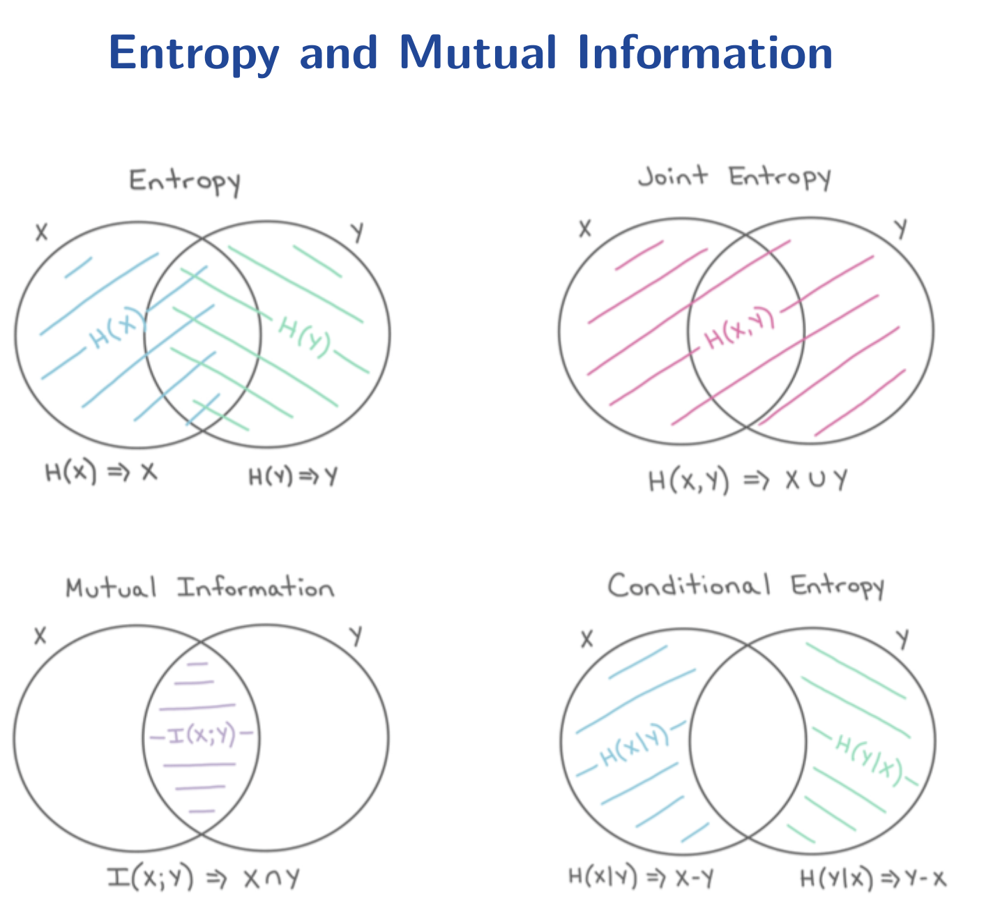

# EE142 Information Theory Course Note

> - textbook: Elements of Information Theory.
> - author: Thomas M. Cover
> - course: ShanghaiTech EE142 Information Theory

[TOC]

## Introduction

Two main questions in information theory:

- source coding: limit of (lossless) data compression.  
  Answer: information entropy.
- channel coding: limit of (error-free) data transmission rate.  
  Answer: channel capacity.

Background settings of information theory:

- classical information theory: p2p (point-to-point) direct data transmission.
- network information theory: MIMO (multiple input and multiple output) broadcasting channel.

## Elements in Digital Communication System

The blocks

- source
- encoder
- channel
- decoder
- sink

Encode/Decode:

- Source coding: data compression
- Channel coding: error detection and correction

Why modulation?  
Answer: baseband transmission to passband transmission.

### Source

Either analog or discrete.

### Channel

Either memoryless or with memory.

Consider the following binary discrete memoryless channels,
whose input and output are denoted by $X$ and $Y$ respectively.

- channel 1: $P(X=\ast,Y=\ast)=\frac{1}{2}$.  
  Channel capacity is zero, no data can be transmitted.
- channel 2: $P(Y=1|X=0)=1-\epsilon=P(Y=0|X=1)$ where $\epsilon$ is a small positive real number.  
  Good channel.
- channel 3: $P(Y=0|X=0)=1-\epsilon=P(Y=1|X=1)$ where $\epsilon$ is a small positive real number.
  Equivalent to channel 2.

Channels covered in EE142 course:

- Discrete ones
  - Binary symmetric channel: $0\to 1$ and $1\to 0$ with fixed probability.
  - Binary erasure channel: $0\to \epsilon$ and $1\to \epsilon$ with fixed probability.
- Continuous ones
  - AWGN (Additive White Gaussian Channel): Output $Y(t)=X(t)+Z(t)$, where $Z(t)$ is a Gaussian process.  
    Capacity (bits per second) $C = W \log_2 \left( 1 + \frac{P}{N_0 W} \right)$,  
	where $W$ spectrum bandwidth, $P$ tx power, $N_0$ channel noise power.
  - Linear Gaussian Channel: AWGN with a LTI filter $H$.
    $Y = H\ast X + Z$.

## Basic Concepts

### Entropy

For a discrete random variable $X$ whose support is $\chi$.
Define the entropy of $X$ to be

$$
H(X)
= \sum_{x\in \chi} -p(x) \log p(x)
= \sum_{x\in \chi} p(x) \log \frac{1}{p(x)}
= \mathbb{E}\left[ \log \frac{1}{p_X(X)}\right]
$$

Mean of self information

**Note** differential entropy and $2^{H(X)}$ are used to measure the uncertainty for continuous random variables.  
$H(x) = \int f(x)\log \frac{1}{f(x)} \mathrm{d} x$ 

### Bounds of Entropy

- $H(X)\geq 0$.
  $p(x)\in [0,1]\implies -\log p(x) \geq 0$.
- $H(X)\leq \log |\chi|$. Jensen's inequality. (if and only if 

Suppose that $\chi=\{1,2,3\ldots n\}$ and $\Pr(X=i)=p_i$.
(WLOG, assume that $p_1,p_2\ldots p_n$ are distinct.
Consider another random variable $Y$ where $\Pr(Y=\frac{1}{p_i}) = p_i$

Then $H(X) = \mathbb{E}[ \log_2 Y ]$,
where $\log_2(\cdot)$ is convex.

By Jensen's inequality, $H(X) = \mathbb{E}[ \log_2 Y ] \leq \log_2(\mathbb{E}\, Y) = \log_2 n$.  
Equality hold when $X=\operatorname{Unif}\{1,2,3\ldots n\}$.

An alternative proof with $\ln x \leq x+1$:

$$
\begin{aligned}
H(X) - \ln n 
&= \sum_{i} p_i \left( \ln \frac{1}{p_i} - \ln n \right)
= \sum_{i} p_i \ln \frac{1}{n p_i}\\
&\leq \sum_{i} p_i \left( \frac{1}{n p_i} - 1\right)
=\sum_{i} \frac{1}{n} - \sum_{i} p_i
=0
\end{aligned}
$$

We have the equality iff $\frac{1}{n p_i}=1$ hold true for all $i$,
that is $X$ is a discrete uniform distribution.

### Convexity of Entropy

For $X\sim \mathrm{Bern}(p)$ that is $X=\begin{cases}
1 & \text{w.p.}\ p\\
0 & \text{w.p.}\ 1-p\\
\end{cases}$.

The entropy of this binary random variable $H(X)=p\log\frac{1}{p} + (1-p)\log\frac{1}{1-p}$
is denoted as $H(p)$.
This is a concave function.

Extension: $H(\vec{p})$ where $\vec{p}=(p_1,p_2\ldots p_n)$ such that $\sum_{i} p_i=1$.
$H(\vec{p})=\sum_{i} p_i \log \frac{1}{p_i}$ is a concave function of $\vec{p}$.

$$
\forall \vec{x},\vec{y} .
\forall \lambda \in (0,1) .
\quad
H(\lambda \vec{x} + (1-\lambda) \vec{y})
\geq \lambda f(\vec{x}) + (1-\lambda) f(\vec{y})
$$

#### Proof 1: By definition

Knowing that $x \ln \frac{1}{x}$ is concave on interval $(0,1)$,
we have

$$
\forall x,y\in (0,1) .
\forall \lambda \in (0,1) .
\quad
\lambda x\ln \frac{1}{x} + (1-\lambda) y\ln \frac{1}{y}
\leq
\left[ \lambda x + (1-\lambda)y \right]
\frac{1}{\lambda x + (1-\lambda)y}
$$

Consider the entropy.

$$
\begin{aligned}
H(\lambda \vec{x} + (1-\lambda) \vec{y})
&= \sum_{i} \left[\lambda x_i + (1-\lambda) y_i\right]
   \ln \dfrac{1}{ \left[\lambda x_i + (1-\lambda) y_i\right] }\\
&\geq \sum_{i} \left(
 \lambda x_i \ln \frac{1}{x_i} +(1-\lambda) y_i \ln \frac{1}{y_i}
\right)\\
&= \lambda \sum_{i} x_i \ln \frac{1}{x_i} + (1-\lambda) \sum_{i} y_i \ln \frac{1}{y_i}\\
&=\lambda H(\vec{x}) + (1-\lambda) H(\vec{y})
\end{aligned}
$$

Q.E.D.

#### Proof 2: Hessian matrix is negative-definite

Consider the Hessian matrix

$$
\begin{aligned}
H(\vec{p})
&= \sum_{i} p_i \log \frac{1}{p_i}\\
\nabla H(\vec{p})
&= \begin{bmatrix}
\frac{\partial}{\partial p_i}\left( -p_i \log p_i \right)
\end{bmatrix}_{i}
= \begin{bmatrix} - \ln p_i - 1 \end{bmatrix}_{i}\\
\nabla^2 H(\vec{p})
&= \begin{bmatrix}
\frac{\partial}{\partial p_i} \left( -\ln p_j - 1 \right)
\end{bmatrix}_{i,j}
=\operatorname{diag}\left( \frac{-1}{p_1}, \frac{-1}{p_2} \ldots \frac{-1}{p_n} \right)
\end{aligned}
$$

As the Hessian matrix is a negative-definite matrix, the scalar-field $H(\vec{x})$ is concave.

### Entropy of Multiple Variables

**Side Note:** The support of $X,Y$ are not necessarily the same.

#### Joint Entropy

Given two random variables $X,Y$ whose joint PMF is $p(x,y)$.
The joint entropy is simply the entropy of the random vector $(X,Y)$.

$$
H(X,Y) = \sum_{x,y} p(x,y) \log \frac{1}{p(x,y)}
=\mathbb{E}_{p(X,Y)} \left[
\log \frac{1}{p(X,Y)}
\right]
$$

#### Conditional Entropy

Condition on a single event

$$
H(Y|X=x) = \sum_{y} p(y|x) \log \frac{1}{p(y|x)}
=\mathbb{E}_{p(Y|X=x)}\left[
\log \frac{1}{p(Y|X=x)}
\right]
$$

Condition on a variable that is condition on a distribution

$$
\begin{aligned}
H(Y|X) 
&= \sum_{x} \Pr(X=x) H(Y|X=x)\\
&= \sum_{x} \Pr(X=x) \sum_{y} p(y|x) \log \frac{1}{p(y|x)}
= \sum_{x}  \sum_{y} p(x,y) \log \frac{1}{p(y|x)}\\
&= \sum_{x,y} p(x,y) \log\frac{1}{p(y|x)}\\
&= \mathbb{E}_{p(X,Y)}\left[
\log \frac{1}{p(Y|X)}
\right]
\end{aligned}
$$

#### Mutual Information

The mutual information measures:

- How much uncertainty of $X$ is fixed when knowing $Y$.
- How much uncertainty of $Y$ is fixed when knowing $X$.
- How much uncertainty is shared by $X$ and $Y$.

$$
I(X;Y) = \sum_{x,y} p(x,y) \log \frac{p(x,y)}{p(x)p(y)}
= \mathbb{E}_{p(X,Y)} \left[
\log \frac{p(X,Y)}{p(X)p(Y)}
\right]
$$

#### Relative Entropy

Also called Kullback–Leibler divergence. It measures the difference of two distribution with identical support.

Suppose that $p$ and $q$ are two probability distributions on the same support $S$.

$$
D(p||q) = \sum_{x} p(x)\log \frac{p(x)}{q(x)}
= \mathbb{E}_{p(X)} \left[
\log \frac{p(X)}{q(X)}
\right]
$$

**Caveat**: KL-divergence is not a _metric_

- Asymmetric: $D(p||q) = D(q||p)$ is not true in general.
- No triangular inequality: $D(p||r) + D(r||q) \geq D(p||q)$ not hold in general.

See [wikipedia: statistical distance](https://en.wikipedia.org/wiki/Statistical_distance) for more elaboration.

#### Cross Entropy

Similar to Kullback–Leibler divergence which measures the difference of two distribution with identical support.

Suppose that $P$ and $Q$ are two probability distribution on the same support $S$.

$$
CE(P,Q) = \sum_{x} p(x) \log \frac{1}{q(x)}
=\mathbb{E}_{p(X)} \left[
\log \frac{1}{q(X)}
\right]
$$

### Entropy algebraic Relations

All the following simply properties can be proved by
patterns recognition and summation transform.

1. $CE(P,P) = H(P)$
2. $D(p||q) = CE(P,Q)-H(P)$
3. $I(X;Y) = I(Y;X)$
4. $I(X;Y) = D\left(\ p(X,Y) || p(X)p(Y) \ \right)$
5. $I(X;Y) = H(X)-H(X|Y)$
6. $H(X,Y) = H(X)+H(Y)-I(X;Y)$
7. Chain rule 1: $H(X,Y)=H(X)+H(Y|X)$ and $I(X_1,X_2; Y) = I(X_1; Y) + I(X_2; Y| X_1)$
8. Chain rule 2: $D_{KL}( p(x,y) || q(x,y) ) = D(p(y|x) || q(y|x)) + D( p(x) || q(x) )$

#### Theorem 1: self cross entropy and entropy

Entropy of $X$ is the cross entropy between $X$ and $X$.

$$
\begin{aligned}
CE(P,Q) &= \mathbb{E}_{p(X)} \left[ \log \frac{1}{q(X)} \right]\\
CE(P,P) &= \mathbb{E}_{p(X)} \left[ \log \frac{1}{p(X)} \right] = H(P)\\
\end{aligned}
$$

#### Theorem 2: KL-divergence and cross entropy

KL-divergence of $P,Q$ and cross entropy of $P,Q$ differs by entropy of $P$.

$$
\begin{aligned}
CE(P,Q) - CE(P,P) 
&=\mathbb{E}_{p(X)} \left[ \log \frac{1}{q(X)} \right] - \mathbb{E}_{p(X)} \left[ \log \frac{1}{p(X)} \right]\\
&=\mathbb{E}_{p(X)} \left[ \log \frac{p(X)}{q(X)} \right]\\
&=D(p||q)
\end{aligned}
$$

#### Theorem 3: Mutual information is symmetric

$$
I(X;Y) 
= \mathbb{E}_{p(X,Y)} \left[ \log \frac{p(X,Y)}{p(X)p(Y)} \right]
= \mathbb{E}_{p(Y,X)} \left[ \log \frac{p(Y,X)}{p(Y)p(X)} \right]
= I(Y;X) 
$$

#### Theorem 4: Mutual information in terms of KL-divergence

Mutual information is the KL-divergence of joint distribution and product distribution.

$$
I(X;Y) 
= \mathbb{E}_{p(X,Y)} \left[ \log \frac{p(X,Y)}{p(X)p(Y)} \right]
= D\left(\ p(X,Y) || p(X)p(Y) \ \right)
$$

#### Theorem 5: Mutual information is the shared information

$$
\begin{aligned}
I(X;Y) 
&= \sum_{x,y} p(x,y) \log \frac{p(x,y)}{p(x)p(y)}\\
&= \sum_{x,y} p(x,y) \left( \log \frac{1}{p(x)} + \log \frac{p(x,y)}{p(y)} \right)\\
&= \sum_{x,y} p(x,y) \log \frac{1}{p(x)} + \sum_{x,y} p(x,y) \log \frac{p(x,y)}{p(y)}\\
&= H(X) - H(X|Y)\\
\sum_{x,y} p(x,y) \log \frac{1}{p(x)} 
&= \sum_{x} \sum_{y} p(x,y) \log \frac{1}{p(x)}\\
&= \sum_{x} \log \frac{1}{p(X)} \sum_{y} p(x,y)\\
&= \sum_{x} p(x) \log \frac{1}{p(X)}\\
&= H(X)\\
\sum_{x,y} p(x,y) \log \frac{p(x,y)}{p(y)}
&= \sum_{x,y} p(x,y) \log \frac{1}{p(x,y)/p(y)}\\
&= \sum_{x,y} p(x,y) \log \frac{1}{p(x|y)}\\
&= H(X|Y)\\
\end{aligned}
$$

#### Theorem 6: Principle of inclusion and exclusion.

$$
\begin{aligned}
H(X)+H(Y)
&=\sum_{x} p(x) \log \frac{1}{p(x)} + \sum_{y} p(y) \log \frac{1}{p(y)}\\
&=\sum_{x,y} p(x,y) \log \frac{1}{p(x)} + \sum_{x,y} p(x,y) \log \frac{1}{p(y)}\\
&=\sum_{x,y} p(x,y) \log \frac{1}{p(x)p(y)}\\
&=\sum_{x,y} p(x,y) \log \frac{p(x,y)}{p(x)p(y)} - \sum_{x,y} p(x,y) \log p(x,y)\\
&=\sum_{x,y} p(x,y) \log \frac{p(x,y)}{p(x)p(y)} + \sum_{x,y} p(x,y) \log \frac{1}{p(x,y)}\\
&=I(X;Y) + H(X,Y)
\end{aligned}
$$

#### Theorem 7: Chain rules of entropy

Simple form: $H(X,Y)=H(X)+H(Y|X)$

$$
\begin{aligned}
H(X_1,X_2\ldots X_n)
&= \mathbb{E}\left[\log \frac{1}{p(X_1,X_2\ldots X_n)}\right]\\
&= \mathbb{E}\left[\log \frac{1}{p(X_1)p(X_2\ldots X_n|X_1)}\right]\\
&= \mathbb{E}\left[\log \frac{1}{p(X_1)} \right] + \mathbb{E}\left[\log \frac{1}{p(X_2\ldots X_n|X_1)}\right]\\
&= H(X_1) + H(X_2\ldots X_n|X_1)\\
H(X_2\ldots X_n|X_1)
&= \mathbb{E}\left[\log \frac{1}{p(X_2,X_3\ldots X_n|X_1)}\right]\\
&= \mathbb{E}\left[\log \frac{1}{p(X_2|X_1)p(X_3\ldots X_n|X_2)}\right]\\
&= \mathbb{E}\left[\log \frac{1}{p(X_2|X_1)} \right] + \mathbb{E}\left[\log \frac{1}{p(X_3\ldots X_n|X_1,X_2)}\right]\\
&= H(X_2|X_1) + H(X_3\ldots X_n|X_1,X_2)\\
H(X_1,X_2\ldots X_n)
&=H(X_1) + H(X_2|X_1) + H(X_3|X_1,X_2) \ldots H(X_n|X_1\ldots X_{n-1})\\
&=\sum_{i=1}^{n} H(X_i|X_1,X_2\ldots X_{i-1})
\end{aligned}
$$

For mutual information 

$$
\begin{aligned}
I(X_1,X_2;Y)
&=H(X_1,X_2)-H(X_1,X_2|Y)\\
&=H(X_1)+H(X_2|X_1) - \left[ H(X_1|Y)+H(X_2|X_1,Y) \right]\\
&=H(X_1)-H(X_1|Y) + H(X_2|X_1)-H(X_2|X_1,Y)\\
&=I(X_1;Y) + I(X_2;Y | X_1)
\end{aligned}
$$

In general:

$$
\begin{aligned}
I(X_1,X_2\ldots X_n;Y)
&=H(X_1\ldots X_n) - H(X_1\ldots X_n|Y)\\
&=\sum_{i=1}^{n} H(X_i|X_1\ldots X_{i-1}) - \sum_{i=1}^{n} H(X_i|X_1\ldots X_{i-1},Y)\\
&=\sum_{i=1}^{n} H(X_i|X_1\ldots X_{i-1}) - H(X_i|X_1\ldots X_{i-1},Y)\\
&=\sum_{i=1}^{n} I(X_i;Y|X_1\ldots X_{i-1})
\end{aligned}
$$

Chain rules are also hold for conditional joint entropy and conditional mutual information.

#### Theorem 8: KL-divergence of joint/conditional distribution

$D_{KL}( p(x,y) || q(x,y) ) = D(p(y|x) || q(y|x)) + D( p(x) || q(x) )$

$$
\begin{aligned}
D_{KL}( p(x,y) || q(x,y) )
&= \mathbb{E}_{p(X,Y)}\left[
\log \frac{p(X,Y)}{q(X,Y)}
\right]\\
&= \mathbb{E}_{p(X,Y)}\left[
\log \frac{p(Y|X)}{q(Y|X)}
\right]
+\mathbb{E}_{p(X,Y)}\left[
\log \frac{p(X)}{q(X)}
\right]\\
&= \mathbb{E}_{p(X,Y)}\left[
\log \frac{p(Y|X)}{q(Y|X)}
\right]
+\mathbb{E}_{p(X)}\left[
\log \frac{p(X)}{q(X)}
\right]\\
&= D(p(y|x) || q(y|x)) + D( p(x) || q(x) )
\end{aligned}
$$

### Uncertainty Cardinality Analogy

- entropy $H(X)$: measure of uncertainty.
- joint entropy $H(X,Y)$: union of uncertainty of $X$ and $Y$.
- mutual information $I(X;Y)$: intersection of uncertainty of $X$ and $Y$.
- conditional entropy $H(X|Y)=H(X)-I(X;Y)$: set difference $X\setminus Y = X\cap \overline{Y}$.

Generalization for three or more variables: $I(X_1;X_2;\ldots ;X_n) = I(X_1;\ldots ;X_{n-1}) - I(X_1;\ldots ;X_{n-1} | X_n)$

### Independent and Determined

- $Y=f(X) \iff H(Y|X) = 0$. $Y$ Determined by $X$.
- $X\perp Y \iff I(X;Y)=0$. $X$ shares not information with $Y$.

**Caveat**: independence of $X,Y$ and conditional independence $X|Z,Y|Z$ are not related.

### Inequalities Toolbox

- [Mean value inequality](https://en.wikipedia.org/wiki/Generalized_mean): quadratic mean, arithmetic mean, geometric mean, harmonic mean
- [Cauchy–Schwarz inequality](https://en.wikipedia.org/wiki/Cauchy%E2%80%93Schwarz_inequality)
- Taylor's series:  
  - $e^x \geq x+1$
  - $\ln x \leq x-1$
  - $\ln \frac{1}{x} \geq 1-x$
- Jensen's inequality:  
  - Random variable $X$ and convex ($f''(x)\geq 0$) function $f$: $\mathbb{E}\left[f(X)\right] \geq f(\mathbb{E} X)$.  
  - Random variable $X$ and concave ($f''(x)\leq 0$) function $f$: $\mathbb{E}\left[f(X)\right] \leq f(\mathbb{E} X)$.  
- Log-sum inequality: Given two sequences of non-negative real numbers $a_i,b_i$.  
  $$\sum_i a_i \ln \frac{a_i}{b_i} \geq \left(\sum_i a_i\right)\ln \frac{\sum_i a_i}{\sum_i b_i}$$

#### Log-Sum Inequality

Consider the random variable $X$ given by

$$
\Pr\left\{X=\frac{b_i}{\sum_j b_j}\right\} = \frac{a_i}{b_i}
\qquad
i=1,2\ldots n
$$

Consider the function $f(x)=x\ln x$ in $(0,1)$.
The second order derivative $f''(x)=x^{-1}>0$ so $f(x)$ is convex.
By Jensen's inequality: $\mathbb{E}\left[f(X)\right] \geq f(\mathbb{E} X)$

$$
\sum_i \frac{b_i}{\sum_j b_j} \left( \frac{a_i}{b_i} \ln \frac{a_i}{b_i} \right)
\geq
\left( \sum_i \frac{b_i}{\sum_j b_j} \frac{a_i}{b_i} \right)
\ln \left( \sum_i \frac{b_i}{\sum_j b_j} \frac{a_i}{b_i} \right)
$$

That is

$$
\sum_i a_i \ln \frac{a_i}{b_i}
\geq
\left( \sum_i a_i \right)
\ln \frac{\sum_i a_i}{\sum_i b_i}
$$

### Relative Entropy Convexity

$D_{KL}(p||q)$ is a convex function of the vector $(p,q)$.

#### Proof

**TODO**

### Mutual Information Convexity

For two random variables $X,Y$:

- If $p(x)$ is fixed, then $I(X;Y)$ is convex in $p(y|x)$.  
  **Data compression** task is non-trivial.  
  Design $p(y|x)$ to minimize the mutual information with fixed $p(x)$, where
  $p(x)$ input, $p(y)$ output, $p(y|x)$ coding.  
  _Convex function minimization_ is non-trivial.
- If $p(y|x)$ is fixed, then $I(X;Y)$ is concave in $p(x)$.  
  **Data transmission** task is non-trivial.  
  Design $p(x)$ to maximize the mutual information with fixed $p(y|x)$, where
  $p(x)$ coding, $p(y|x)$ channel characteristic, $p(y)$ output.  
  _Concave function maximization_ is non-trivial.

#### Convex in conditional distribution

**TODO**

#### Concave in prior distribution

**TODO**

### Entropy Inequality

1. $H(X,Y) \leq H(X)+H(Y)$
2. $H(X|Y) \leq H(X)$
3. Ordering of $H(Y|X=x)$ and $H(Y)$ is undefined.
4. $D_{KL}(P,Q) \geq 0$
5. $I(X;Y) \geq 0$
6. $I(X;Y) \leq \min(H(X),H(Y))$

#### Markov Chain Inequalities

##### Markov Chain

Random variables $X,Y,Z$ are said to form a Markov chain if $p(x,y,z)=p(x)p(y|x)p(z|y)$,
denoted by $X\to Y\to Z$.

- $X\to Y\to Z$ iff $p(x,z|y)$ that is: $X,Z$ are conditional independent when $Y$ is given.
- $X\to Y\to Z$ iff $Z\to Y\to X$.
- If $Z=f(Y)$ or $H(Z|Y)=0$, then $X\to Y\to Z$

Example: $X,Y$ i.i.d. $\mathrm{Bern}(1/2)$ and $Z_1=X\oplus Y$, $Z_2=X+Y$.

##### Data Processing Inequality

- If $X\to Y\to Z$, then $I(X;Y) \geq I(X;Z)$, $I(Y;Z)\geq I(X;Z)$
- If $X\to Y\to Z$, then $I(X;Y|Z) \leq I(X;Y)$
- In general, ordering of $I(X;Y|Z)$ and $I(X;Y)$ is indefinite.
  1. $I(X;Y|Z)\leq I(X;Y)$ case: **TODO**
  2. $I(X;Y|Z)\geq I(X;Y)$ case: **TODO**

If $X\to Y\to Z$, then $X,Z$ are independent given $Y$.

$$
\begin{aligned}
I(X;Y,Z)
&= I(X;Y) + I(X;Z|Y) = I(X;Y)\\
&= I(X;Z) + I(X;Y|Z)\\
I(X;Y) &\geq I(X;Z)\\
I(X;Y) &\geq I(X;Y|Z)
\end{aligned}
$$

**TODO**

#### Fano's Inequality

**TODO**

## Asymptotic Equipartition Property (AEP)

