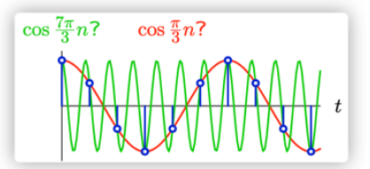
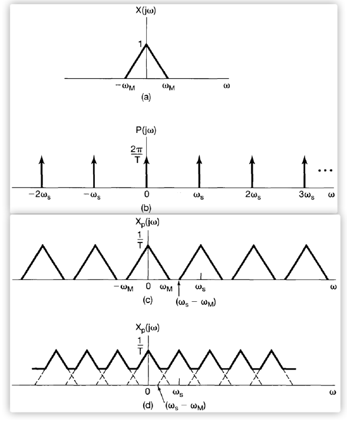
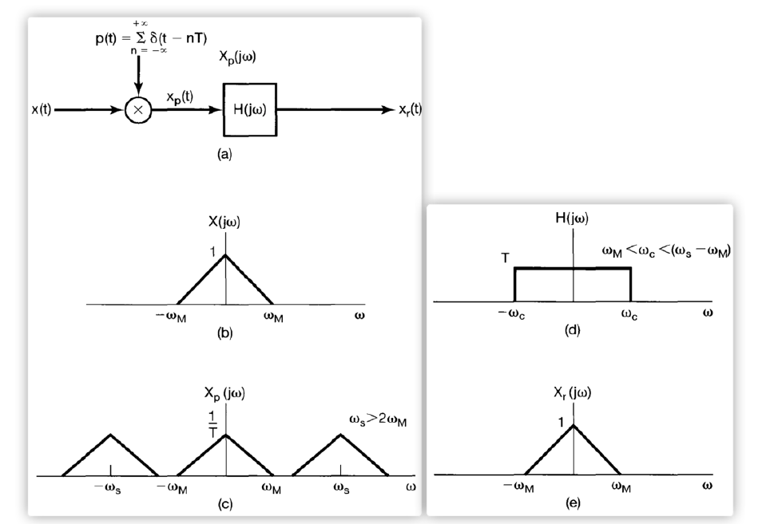
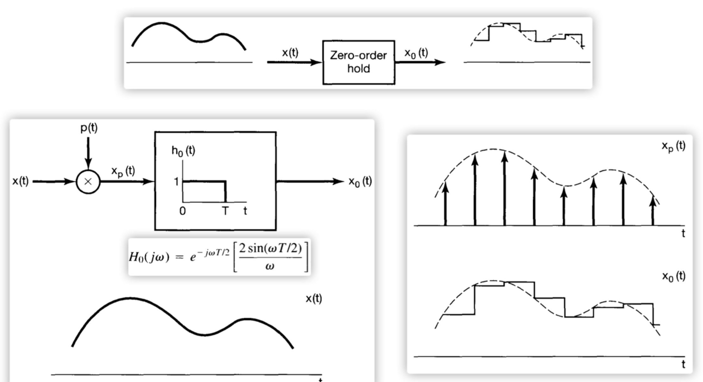
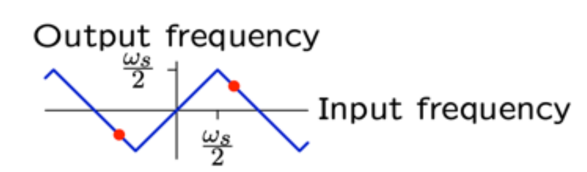

# EE150 course note: Sampling

## Introduction: Sampling Examples

### Polynomial interpolation

For a polynomial of $n$-th order $P(x)=\sum_{i=0}^{n} a_i x^i$.  
If we know the value of $P(x)$ evaluated at $(n+1)$ points 
$(x_0,P(x_0)), (x_1,P(x_1))\ldots (x_n, P(x_n))$,
then we can determine $P(x)$ uniquely.

However, given $n$ points $(x_i,y_i)\ (i=1,2,3\ldots n)$,
we have infinitely many polynomials $P(x)$ of $n$-th order
such that $P(x_i)=y_i$.  
To find one, we can arbitrarily pick another point $(x_0,y_0)$
and use Lagrange's polynomial interpolation formula to determine $P(x)$.

### Sinusoidal evaluated at integral time

For any sinusoidal signal $x(t)=A\cos(\omega t + \varphi)$,  
we can have the uniform unit sampling $x[n]=x(n)$ for $n\in\mathbb{Z}$.

Consider the following two cases

- $x_1(t)=\cos\left( \frac{1\pi}{3} t\right)$, $x_1[n]=\cos\left( \frac{1\pi}{3} n\right)$
- $x_2(t)=\cos\left( \frac{7\pi}{3} t\right)$, $x_2[n]=\cos\left( \frac{7\pi}{3} n\right)$

We know that $\exists t_0 (x_1(t_0)\neq x_2(t_0))$,
however $\forall n (x_1[n]=x_2[n])$.  
That is: provided the uniform unit sampling, we can not distinguish $x_1(t),x_2(t)$.  
In other words: we can not uniquely reconstruct the sinusoidal wave $x(t)$ from $x[n]$.  

The good news is that: for $x(t)=\cos(\omega t)$ and $x[n]=x(1\cdot n)$.  
If $|\omega|<\pi$ we can reconstruct the waveform uniquely.

## The effect of sampling in frequency-domain

Given a continuous-time signal $x(t)$ and its Fourier transform $X(j\omega)=\mathcal{F}\{x(t)\}$.  
Consider the uniform sampling $x[n]=x(nP)$ for some positive real number $P$.  

Let $x_P(t) = \sum_{n=-\infty}^{+\infty}x[n]\delta(t-nP)$ and its Fourier transform $X_P(j\omega) =\mathcal{F}\{x_P(t)\}$.  
We will explore the relationship between $X(j\omega)$ and $X_P(j\omega)$

- $X(j\omega) \to X_P(j\omega)$: the effect on frequency-domain of time-domain sampling
- $X_P(j\omega) \to X(j\omega)$: recovering (interpolating) the original signal from samples

### The Dirac comb: uniform sampling impulse train

- $T_s=P$ is called the sampling period
- $\omega_s = \frac{2\pi}{T_s}$ is called the sampling (angular) frequency.  
- $f_s = \frac{1}{T_s}$ is called the sampling (angular) frequency.  

Let $p(t) = \sum_{n=-\infty}^{+\infty} \delta(t -nP)$, then $x_p(t) = x(t) p(t)$
The impulse train $p(t)$ is known as the Dirac comb
which is a periodic function with fundamental period $P$.

The Fourier series and Fourier transform of $p(t)$ are:

$$
\begin{aligned}
p(t)
&=\sum_{n=-\infty}^{+\infty} \left(
	\frac{1}{P}\int\limits_{P} p(t) e^{-j\omega \tau}\mathrm{d}\tau
\right)e^{j n\omega_s t}
 =\sum_{n=-\infty}^{+\infty} \frac{1}{P}e^{j n\omega_s t}\\
P(j\omega)
&=\mathcal{F}\{ p(t) \}
 =2\pi \sum_{n=-\infty}^{+\infty} \frac{1}{P}\delta(\omega-n\omega_s)
\end{aligned}
$$

### The spectrum of the samples

By frequency-domain convolution, the Fourier transform of $x_p(t)$ is

$$
\begin{aligned}
X_P(j\omega)
&=\mathcal{F}\{ x_{P}(t) \}
 =\mathcal{F}\{ x(t)\cdot p(t) \}\\
&=\frac{1}{2\pi}\left[
	X(j\omega) \ast P(j\omega)
\right]\\
&=\frac{1}{2\pi}\left[
	X(j\omega)
	\ast
	\left(
		\frac{1}{2\pi}
		\sum_{n=-\infty}^{+\infty} \frac{1}{P}\delta(\omega-n\omega_s)
	\right)
\right]\\
&=\frac{1}{P} \sum_{n=-\infty}^{+\infty} X(j\omega) \ast \delta(\omega - n\omega_s)\\
&=\frac{1}{P} \sum_{n=-\infty}^{+\infty} X(j(\omega - n\omega_s))
\end{aligned}
$$

If we have $\omega_0 \to X(j\omega_0)$ in the original signal,  
then we will have $\frac{1}{P}X(j\omega_0)$
at $\omega_0 - n\omega_s$ for every $n\in \mathbb{Z}$.

$$
\omega_0
\to
(\ldots,
\ \omega_0 - 2\omega_s,
\ \omega_0 - \omega_s,
\ \omega_0,
\ \omega_0 + \omega_s,
\ \omega_0 + 2\omega_s,
\ \ldots)
$$

That is:

- uniform sampling in time-domain
- periodic replication in frequency-domain

#### Side note: DTFT of the samples

$$
\begin{aligned}
X_P(j\omega)
&=\int_{-\infty}^{+\infty} x_p(t) e^{-j\omega t}\mathrm{d}t\\
&=\sum_{n=-\infty}^{+\infty}
	\left(
	\int_{-\infty}^{+\infty}
		x(t)\delta(t-nP)
		e^{-j\omega t}
	\mathrm{d}t
	\right)\\
&=\sum_{n=-\infty}^{+\infty} x(nP)e^{-j\omega (nP)}\\
&=\sum_{n=-\infty}^{+\infty} x[n] e^{-j(P\omega) n}\\
&= \mathrm{DTFT}\{ x[n] \} (P\omega)
\end{aligned}
$$

### Sampling band-limited signal

A signal is called band-limited if there exists $\omega_m$
such that $X(j\omega)=0$ for all $|\omega| > \omega_m$.  

Suppose that $X(j\omega)=0$ when $|\omega| >\omega_m$, the sampling frequency is $\omega_s$.  
The spectrum of $x_P(t)=x(t)p(t)$ is $X_P(j\omega) = \sum_{n} X(j(\omega-n\omega_s))$

- left $[-\omega_m - \omega_s, \omega_m - \omega_s]$
- original $[-\omega_m, \omega_m]$
- right $[-\omega_m+\omega_s, \omega_m+\omega_s]$

Comparing $\omega_s-\omega_m$ and $\omega_m$, we have the following findings:

- If $\omega_m < -\omega_m + \omega_s$ that is $\omega_s > 2\omega_m$,  
  then $X_{P}(j\omega) = \frac{1}{P} X(j\omega)$ for $|\omega|<\omega_s-\omega_m<\omega_m$.
- If $\omega_s \leq 2\omega_m$, $X_{P}(j\omega)$ may differ from $\frac{1}{P}X(j\omega)$.  
  This phenomenon is called aliasing.

### The Sampling Theorem

For a band-limited signal $x(t)$, where $X(j\omega)=0$ when $|\omega|>\omega_m$.  
Then $x(t)$ can be fully recovered from the uniform samples $x(nP)$,
if the sampling frequency $\omega_s > 2\omega_m$.  

$\omega_s = 2\omega_m$ is called the _Nyquist rate_

We can use an ideal LPF (with gain $P$ and delay $0$) where the cut-off frequency
$\omega_c$ is in $[\omega_m,\omega_s-\omega_m]$ to recover $X(j\omega)$.

The impulse train sampled signal is

$$
x_{P}(t) = \sum_{n=-\infty}^{+\infty} x(nP)\delta(t-nP)
$$

Consider the LPF, the frequency response is

$$
H(j\omega)=P \begin{cases}
1 & |\omega|<\omega_c\\
0 & \text{elsewhere}
\end{cases}
$$

The impulse response is

$$
h(t) = P \frac{\sin(\omega_c t)}{\pi t}
$$

Therefore, the recovered signal is

$$
\begin{aligned}
x_{P}(t) \ast h(t)
&=h(t)\ast\sum_{n=-\infty}^{+\infty} x(nP)\delta(t-nP)\\
&=\sum_{n=-\infty}^{+\infty} x(nP)h(t-nP)\\
&=\sum_{n=-\infty}^{+\infty} x(nP) \frac{P}{\pi} \frac{\sin(\omega_c (t-nP))}{t-nP}
\end{aligned}
$$

## Sampling with zero-order hold

$\delta(t-nT)\to h_0(t-nT)$ where $h(t) = \begin{cases} 1 & 0<t<T \\ 0 & \text{otherwise}\\\end{cases}$.

To recover, we have to use an ideal LPF combined with $H_0^{-1}$.

## Aliasing

Suppose that the sampling frequency $\omega_s$ is fixed.  
We use an LPF with cut-off frequency $\omega_c=\frac{1}{2}\omega_s$ to recover from samples.

After sampling, the spectrum become:

$$
\omega
\to (\omega-n\omega_s)
=   (\ldots,\ \omega-2\omega_s,\omega-\omega_s,\omega,\omega+\omega_s,\omega+2\omega_s\ldots)
$$

Consider the components in $[-\omega_c,\omega_c]=\left[-\frac{1}{2}\omega_s,\frac{1}{2}\omega_s\right]$.

$$
\begin{cases}
-\omega_c < \omega-n\omega_s\\
\omega-n\omega_s < -\omega_c\\
\end{cases}
\implies
\begin{cases}
n< \frac{\omega+\omega_c}{\omega_s}\\
n> \frac{\omega-\omega_c}{\omega_s}\\
\end{cases}
$$

That is

$$
\frac{\omega}{\omega_s} - \frac{1}{2}
<n<
\frac{\omega}{\omega_s} + \frac{1}{2}
$$

For example:

$$
\begin{aligned}
\omega &\in [-2\omega_s,-\frac{3}{2}\omega_s]           & n&=-2 & \omega+2\omega_s\\
\omega &\in [-\frac{3}{2}\omega_s,-\omega_s]            & n&=-1 & \omega+1\omega_s\\
\omega &\in [-\omega_s,-\frac{1}{2}\omega_s]            & n&=-1 & \omega+1\omega_s\\
\omega &\in [-\frac{1}{2}\omega_s,\frac{1}{2}\omega_s]  & n&= 0 & \omega\\
\omega &\in [\frac{1}{2}\omega_s,\omega_s]              & n&= 1 & \omega+1\omega_s\\
\omega &\in [\omega_s,\frac{3}{2}\omega_s]              & n&= 1 & \omega+1\omega_s\\
\omega &\in [\frac{3}{2}\omega_s,2\omega_s]             & n&= 2 & \omega+2\omega_s\\
\end{aligned}
$$

**TODO**

## Sampling discrete-time signals

**TODO**
